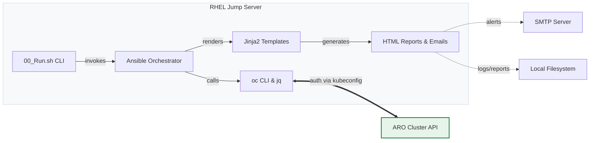
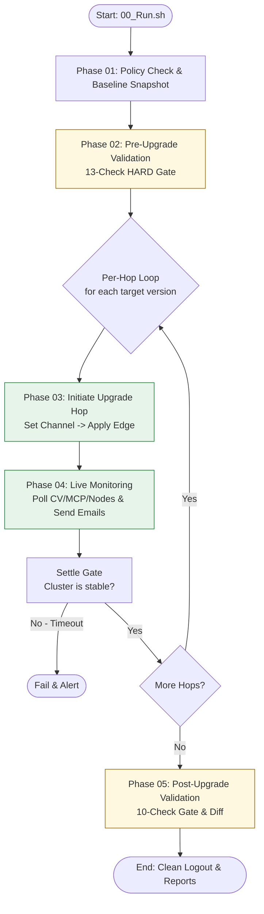

# ARO Cluster Upgrade Automation — Comprehensive Documentation

This document serves as the complete, running, cumulative record of the ARO Cluster Upgrade Automation project. It details the system structure, architecture, workflow, connections, and historical execution units.

> [!NOTE]
> This project is a deterministic, rule-based Ansible automation suite built for cloud/platform engineers. It performs Y-stream (minor) upgrades of Azure Red Hat OpenShift (ARO) clusters as ordered, sequential version hops. **There is no AI in the execution path.**

---

## 1. System Architecture

The architecture is built on a simple yet robust stack, designed to run unchanged on both **Ansible 2.7.17 (test)** and **Ansible 2.14.18 (prod)**.

### Technology Stack

| Layer | Technology | Role |
|---|---|---|
| **Orchestration** | Ansible | Runs `main.yml`, chains isolated phases, drives the per-hop loop. |
| **CLI Entrypoint** | Bash (`00_Run.sh`) | Control surface: sets paths, captures input, runs playbook. |
| **Cluster Interface**| `oc` CLI | All live cluster reads and upgrade triggers (`oc adm upgrade --to`). |
| **Data Parsing** | `jq` (v1.5) | Parses JSON output for cluster components. |
| **Notifications** | `sendmail` / `mail` | Sends colour-coded HTML heartbeat and change-alert emails. |
| **Reporting** | Jinja2 Templates | Renders pre/post-validation HTML reports and progress emails. |

### Architecture Flow

---

## 2. Core Workflow & Pipeline

The upgrade lifecycle is divided into isolated phases controlled by the master `main.yml` orchestrator. The pipeline enforces strict gates before and after upgrading.

### Phase Summary

* **Phase 01 (`01_Policy_Check.yaml`)**: Logs in once, captures a baseline JSON snapshot of nodes/operators/routes, and validates the upgrade path edges.
* **Phase 02 (`02_Pre_upgrade_check.yaml`)**: Runs 13 checks (7 HARD, 6 WARN). Any HARD failure halts the execution and logs out safely.
* **Phase 03 (`03_Initiate_upgrade.yaml`)**: Loops over the `upgrade_path`, setting channels, applying admin-acks, and triggering the upgrade.
* **Phase 04 (`04_Live_monitoring_upgrade.yaml`)**: Included dynamically in Phase 03. Polls the cluster every 2 mins, checking MCP/Nodes. Sends 20-min heartbeats.
* **Phase 05 (`05_post_Upgrade_Checks.yaml`)**: Runs 10 post-upgrade checks and diffs the current cluster state against the Phase 01 snapshot.

---

## 3. Storage & State Boundaries

The automation enforces a strict boundary for reading and writing data, ensuring stateless safety between phases.

| Subsystem | Boundary | Purpose |
|---|---|---|
| **Root** | `playbooks/` | Orchestration playbooks and entrypoint wrapper. |
| **Logic** | `playbooks/roles/` | Isolated single-concern reusable units (e.g., `mcp`, `node`, `error_handle`). |
| **Logic** | `playbooks/tasks/` | Minor task includes, specifically the per-hop sequence `hop.yml`. |
| **Inputs** | `playbooks/vars/` | Config, thresholds, secrets (via Vault references), regex rules. **No logic.** |
| **Views** | `playbooks/templates/` | Jinja2 UI rendering for emails and HTML reports. **No cluster logic.** |
| **Outputs** | `playbooks/logs/` | Write-only `txt` and `csv` run records. |
| **Outputs** | `playbooks/output/` | Write-only HTML reports for validation results. |
| **Outputs** | `playbooks/snapshots/` | The **ONLY** sanctioned cross-phase persisted state (baseline JSON). |

> [!CAUTION]
> **No Secrets Persisted:** Passwords, tokens, and kubeconfigs are never recorded in facts, log files, or email alert bodies. All variable injection is evaluated dynamically at runtime.

---

## 4. Execution Principles & Invariants

To guarantee production safety, the suite adheres strictly to the following rules:

1. **Deterministic Execution:** No AI or agentic branching logic in the execution path. All conditions use `when:` and `fail:` gates.
2. **Single Session:** Logs in once at Phase 01. Reuses the session.
3. **Guaranteed Teardown:** Every phase uses `block/rescue/always` blocks. If any failure occurs, the session is torn down securely via `oc logout` and the `.kubeconfig` file is deleted.
4. **Live Reads Only:** No cross-phase state caching (except the Phase 01 JSON baseline). All checks execute live against the `oc` CLI.
5. **Ordered Execution:** Minor versions are never skipped. The automation processes `upgrade_path` sequentially.

---

## 5. Development History & Units Built

Below is the cumulative build record of the system components.

### Foundational Units
* **Unit 01:** Scaffolded project structure (`vars/`, `roles/`, `tasks/`, `logs/`) and declarative variables.
* **Unit 02:** Created `00_Run.sh` entrypoint and `main.yml` skeleton. Implemented error code taxonomy and parameter input logic.
* **Unit 03:** Built `login` and `logout` roles. Established the "Login once, logout on failure" `block/rescue/always` contract.
* **Unit 04:** Developed `error-report.j2` and `progress-mail.j2` email templates. Ensured mobile-responsive and colour-accessible HTML structure.
* **Unit 05:** Created the `sendmail` role with dual-implementation (`shell` sendmail for v2.7 and `community.general.mail` for v2.14).
* **Unit 06:** Built `error_handle` role to standardize failure logging to `.txt` and `.csv` files and trigger alerts.
* **Unit 07:** Built `snapshot` role and Phase 01. Persists cluster baseline state and validates upgrade path edges dynamically.

### Validation Gates (Phase 02)
* **Unit 08:** Built `api_check` and `api_readiness` for basic context verification.
* **Unit 09:** Built `co` role (HARD gate) ensuring all ClusterOperators are Available/Not Degraded.
* **Unit 10:** Built `mcp` role (HARD gate) ensuring MachineConfigPools are Updated and active.
* **Unit 11:** Built `node` role (HARD gate) enforcing node readiness and detecting cordons.
* **Unit 12:** Configured `etcd` checks (HARD gate) for control plane health.
* **Unit 13:** Built `utilization` role (HARD gate). Evaluates node capacity strictly based on committed resource requests via `jq` normalization.
* **Unit 14:** Built `pv`, `pvc`, and `pdb` WARN roles. Inspects storage phases and deadlock risks caused by strict PodDisruptionBudgets.
* **Unit 15:** Designed `health-overview.j2` and `report` role. Renders client-facing HTML pre-upgrade diagnostics with copy-to-clipboard functionality.
* **Unit 16:** Assembled `prevalidation` aggregator and Phase 02 playbook, chaining all 13 checks sequentially with HARD/WARN evaluation.

### Upgrade & Monitoring (Phases 03 & 04)
* **Unit 17:** Built `upgrade` role and Phase 03 (`hop.yml`). Implemented channel setting, edge verification, admin-ack injection, and triggered `oc adm upgrade`.
* **Unit 18:** Built `monitor` role and Phase 04. Polled CV, MCP, and Nodes iteratively. Generated state-change fingerprints, dispatched heartbeat emails, enforced timeouts, and asserted the inter-hop settle gate.

### Post-Upgrade & Hand-off (Phase 05)
* **Unit 19:** Finalized `postvalidation` aggregator and Phase 05. Ran 10 post-checks, executed baseline diffing against the Unit 07 JSON snapshot, completed wiring in `main.yml`, and delivered final project documentation.

### Maintenance & Bug Fixes
* **Bug Fix:** Fixed an infinite recursion bug in `roles/snapshot/defaults/main.yml` caused by self-referencing Jinja2 variables (`snapshot_timestamp: "{{ snapshot_timestamp | default('') }}"`). This bug caused an unhandled templating exception during Phase 01 execution and triggered a cascading failure in the `error_handle` role. The defaults were updated to use plain empty strings.
* **Bug Fix:** Fixed a Jinja2 templating type error in `roles/snapshot/tasks/main.yml` and `roles/postvalidation/tasks/main.yml`. The Kubernetes API returns arrays under the key `"items"`, but `dict.items` in Jinja2 resolves to the Python method instead of the key. Replaced `.items` with bracket notation `['items']` to ensure iteration over the JSON list. Also replaced a `dict.items()` dictionary iteration loop with the standard, universally-supported Jinja2 `dictsort` filter (as the Ansible `dict2items` filter was unavailable in this execution environment).
* **Bug Fix (`upgrade_path` CLI String vs List Parsing):** When `00_Run.sh` invoked `ansible-playbook` with `-e "cluster_name=... upgrade_path=[...]"` in `key=value` format, Ansible stored `upgrade_path` as a literal string `'["4.20.8", "4.20.33"]'`. In `01_Policy_Check.yaml`, evaluating `upgrade_path | first` returned the first character `[` instead of the first version element, resulting in the failure: `Target version '[' is not a valid upgrade edge`. Resolved by formatting `-e` in `00_Run.sh` as a valid JSON object string (`-e '{"cluster_name":"...","upgrade_path":[...]}'`), which Ansible parses via `json.loads` directly into a Python list, and added defensive normalization in `01_Policy_Check.yaml`.
* **Bug Fix (Jinja2 Infinite Recursion in `error_handle` Rescue Blocks):** In `01_Policy_Check.yaml`, `02_Pre_upgrade_check.yaml`, `05_post_Upgrade_Checks.yaml`, and `playbooks/tasks/hop.yml`, the `rescue:` blocks called `include_role: name: error_handle` with `vars: failure_reason: "{{ failure_reason }}"` and `failure_observed: "{{ failure_observed }}"`. Passing identical variable names in role `vars` created recursive templating loops when `error_handle` evaluated those variables, resulting in `AnsibleError: An unhandled exception occurred while templating '{{ failure_observed }}'`. Removed redundant self-referencing vars from the role invocation, allowing `error_handle` to read the facts directly from host scope.
* **Bug Fix (`contains` Filter in `prevalidation` Role):** In `roles/prevalidation/tasks/main.yml`, evaluated admin-ack strings with an invalid Jinja2 filter syntax `| contains('AdminAck')`, causing Jinja2 to fail with `no filter named 'contains'`. Fixed by switching to standard Jinja2 test syntax `is search(...)` (`lower is search('adminack') or lower is search('admin ack') or lower is search('acknowledgement')`).
* **Bug Fix (`ansible_failed_task` FieldAttribute Exception in Rescue Blocks):** In `01_Policy_Check.yaml`, `02_Pre_upgrade_check.yaml`, `05_post_Upgrade_Checks.yaml`, and `tasks/hop.yml`, `failure_reason` evaluated `ansible_failed_task.name`. Because `ansible_failed_task` contains internal Python `FieldAttribute` structures, referencing it during task templating failures triggered unhandled serialization exceptions. Replaced with safe fallback resolution using `ansible_failed_result.msg` and `ansible_failed_result.message`.
* **Bug Fix (`sendmail` Template Path Resolution):** In `roles/sendmail/tasks/main.yml`, task `Resolve email template path` used `'\\'` inside double-quoted YAML. The YAML parser converted `\\` into a single backslash `\`, which escaped the following single quote `'` in Jinja2 and caused an unexpected syntax error (`An exception occurred during task execution... line 1`). Simplified template path detection to check standard forward slashes (`'/' in mail_template`).
* **Bug Fix (`utilization` Role Multiline Shell Command Formatting):** In `roles/utilization/tasks/main.yml`, task `Query Node allocatable and Pod requests`, YAML `shell: >-` separated `jq` arguments onto distinct lines without shell line continuation backslashes (`\`). When executed by `/bin/sh`, lines containing `--arg max_cpu ...` were executed as separate shell commands, failing with `/bin/sh: 3: --arg: not found`. Switched to `shell: |` with explicit `\` line continuations.
* **Bug Fix (`error_handle` → `sendmail` `failed_phase` Jinja2 Recursion):** In `roles/error_handle/tasks/main.yml`, calling `include_role: name: sendmail` passed `vars: failed_phase: "{{ failed_phase | default(...) }}"`. During `error-report.j2` rendering, Jinja2 attempted to resolve `failed_phase` against its own template definition in an infinite loop (`An unhandled exception occurred while templating '{{ failed_phase | default(...) }}'`). Resolved by computing a concrete fact `resolved_failed_phase` in step 1 and passing that fact cleanly to `sendmail`.
* **Enhancement (`sendmail` Role Native SMTP Delivery):** Upgraded `roles/sendmail/tasks/main.yml` to use Ansible's built-in `mail:` module directly (connecting over TCP to `smtp_host:smtp_port` via Python's standard `smtplib`). Replaces the `/usr/sbin/sendmail` local MTA CLI dependency and matches the working server configuration pattern. Added support for optional attachment paths via `mail_attach`.
* **Bug Fix (`jq` 1.5 `round/0 is not defined` compatibility):** In `roles/utilization/tasks/main.yml` and `roles/prevalidation/tasks/main.yml` (Check 11 drain headroom), replaced calls to `round` with a portable helper function. Originally named `round2`, but jq 1.5's lexer tokenizes `round2` as `round` (unknown builtin) + `2` (literal), still producing `round/0 is not defined`. Renamed to `rnd2` to fully avoid collisions with any jq keyword on all versions.
* **Bug Fix (`jq` operator precedence `endswith() requires string inputs`):** In `roles/utilization/tasks/main.yml`, the `parse_mem` helper's `elif` for SI kilo units (`"k"` / `"K"`) used `(tostring | endswith("k") or tostring | endswith("K"))`. In jq, `or` binds tighter than `|`, so this was parsed as `tostring | (endswith("k") or tostring) | endswith("K")` — feeding a boolean into `endswith()` and crashing with `endswith() requires string inputs` on any memory value reaching that branch (plain bytes, `"M"`, `"G"` suffixed values). Fixed by adding explicit parentheses: `((tostring | endswith("k")) or (tostring | endswith("K")))`.
* **Bug Fix (Jinja2 Infinite Recursion on `hop_label` in Phase 04 / `tasks/hop.yml`):** In `tasks/hop.yml` when including `04_Live_monitoring_upgrade.yaml` and in `04_Live_monitoring_upgrade.yaml` when including the `monitor` role, passing task/role `vars: hop_label: "{{ hop_label }}"`, `hop_target_version: "{{ hop_target_version }}"`, etc., created recursive variable evaluations where task-scoped variables matched their own templating expressions, failing with `An unhandled exception occurred while templating '{{ hop_label }}'`. Resolved by removing redundant `vars:` blocks because `hop_label`, `hop_target_version`, `hop_number`, and `hop_total` are already set as global host facts via `set_fact` at the start of `tasks/hop.yml`.
* **Bug Fix (`sendmail` Role Email Body Caching Across Multi-Hop Executions):** In `roles/sendmail/tasks/main.yml`, template rendering was guarded with `when: (mail_html_body | default('') | length) == 0`. When an email was dispatched during Hop 1 (progress or heartbeat), `mail_html_body` was recorded into host facts. During Hop 2, when an error occurred and `error_handle` invoked `sendmail` with `mail_template: "error-report.j2"`, the guard skipped re-rendering, causing the cached Hop 1 body to be transmitted under the Hop 2 Alert subject. Resolved by eliminating the stale guard, ensuring `mail_template` is freshly resolved and rendered per invocation, and clearing `mail_html_body` facts post-dispatch.
* **Bug Fix (Command stderr and RBAC Forbidden Error Extraction):** Across all phase rescue blocks (`01_Policy_Check.yaml`, `02_Pre_upgrade_check.yaml`, `05_post_Upgrade_Checks.yaml`, `tasks/hop.yml`, and `roles/error_handle/tasks/main.yml`), error handling previously inspected only `ansible_failed_result.msg`, which captured generic messages such as `"non-zero return code"`. Updated the error resolution hierarchy to prioritize `ansible_failed_result.stderr` and `ansible_failed_result.stderr_lines`. Added automated detection for RBAC permission denials (`forbidden`, `cannot patch`, `cannot get`, `unauthorized`), populating `is_rbac_error` facts and generating specialized alert banners with actionable remediation guidance (e.g., granting `cluster-admin` or dedicated upgrade `ClusterRoleBinding`).
* **Bug Fix (MachineConfigPool Email Deserialization & RBAC Access Notice):** In `roles/monitor/tasks/poll_iteration.yml`, `monitor_mcp_display_list` was constructed via Jinja2 loop resulting in a raw JSON string representation rather than a parsed list of dictionaries, causing `progress-mail.j2` to fall back to `N/A ?/?` for every pool row. Resolved by piping the generated JSON through `from_json`. Furthermore, added detection for `oc get mcp` RBAC access errors (`mcp_access_error`), allowing progress emails to render an explicit service account access notice rather than displaying empty or broken tables.
* **Enhancement (Concise & High-Impact Email Templates):** Redesigned both `playbooks/templates/error-report.j2` and `playbooks/templates/progress-mail.j2` into compact, single-card layouts (≤ 580px width) optimized for rapid scanning:
* **Bug Fix (`ansible_failed_result` Undefined Variable in `rescue:` Blocks):** In Ansible 2.7 when tasks are executed within an included task file (`include_tasks: tasks/hop.yml`), `ansible_failed_result` is undefined when entering a `rescue:` block. Referencing subproperties directly (e.g. `ansible_failed_result.stderr` or `ansible_failed_result.msg`) caused the first task in `rescue:` (`Record failure details`) to crash immediately with `'ansible_failed_result' is undefined`, aborting the playbook before `roles/error_handle` and `roles/sendmail` could be reached. Resolved by:
  1. Resolving the failure context in `tasks/hop.yml` directly from explicitly registered task objects (`upgrade_trigger_result`, `force_upgrade_result`, `upgrade_ack_apply_result`, `channel_set_result`, `upgrade_cv_raw`).
  2. Applying safe default dictionaries `(ansible_failed_result | default({}))` across all rescue blocks (`01_Policy_Check.yaml`, `02_Pre_upgrade_check.yaml`, `05_post_Upgrade_Checks.yaml`, `tasks/hop.yml`, and `roles/error_handle/tasks/main.yml`) to guarantee that error handling and alert email dispatch execute reliably on all Ansible versions.

