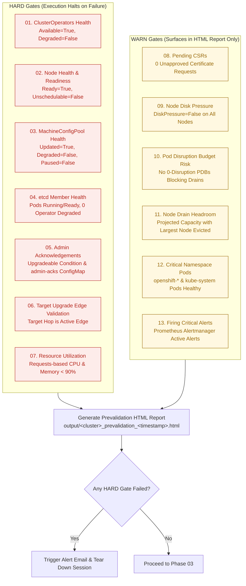
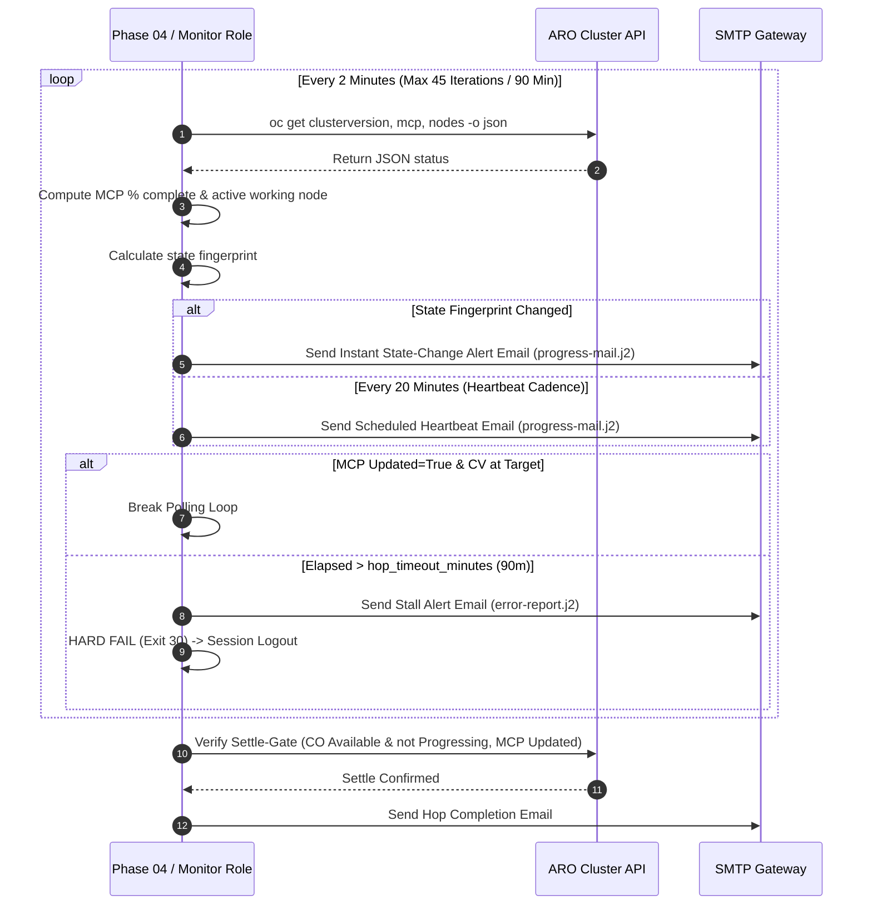
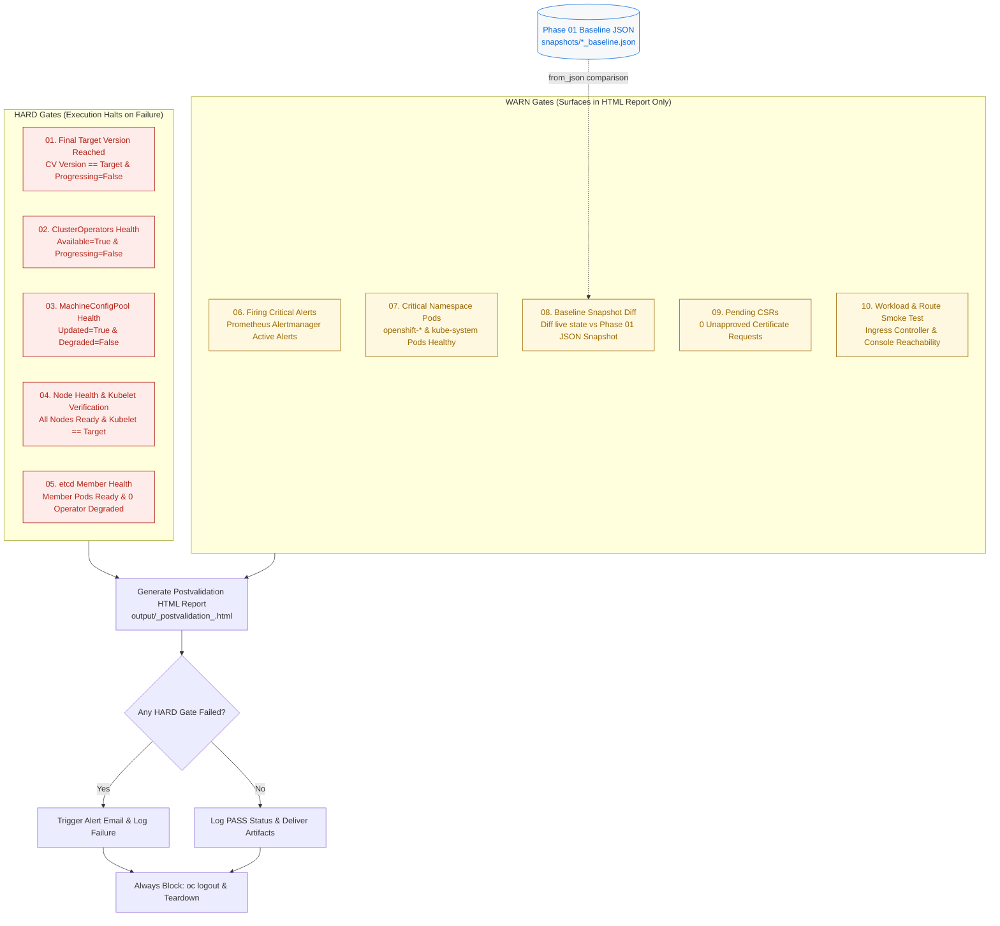
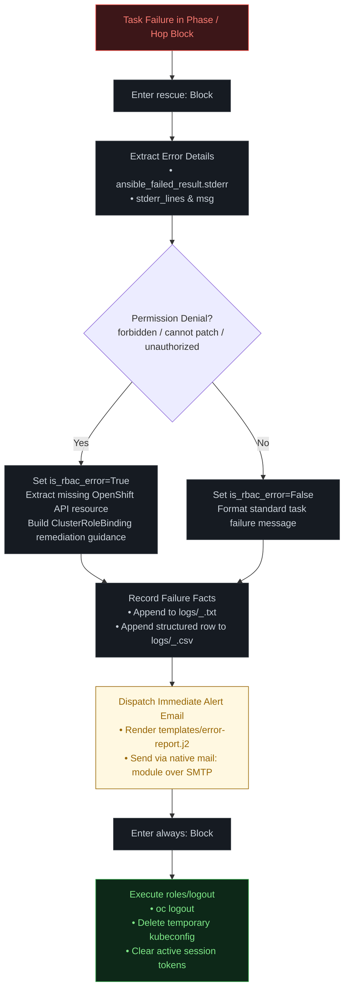

# ARO Cluster Upgrade Automation — Comprehensive Technical Documentation

This document serves as the complete, running, cumulative technical record of the **ARO Cluster Upgrade Automation** project. It details the system architecture, component interactions, execution lifecycle, validation gate specifications, role catalog, security governance, and historical engineering milestones.

> [!NOTE]
> This automation is a **rule-based, deterministic Ansible suite** designed for cloud and platform engineers. It executes sequential minor version upgrades (Y-stream) of Azure Red Hat OpenShift (ARO) clusters without skipping minor versions. **There is zero AI, inference, or non-deterministic branching in the execution path.**

---

## 📑 Table of Contents

1. [System Architecture & Design Principles](#1-system-architecture--design-principles)
2. [Process Surface & Master Orchestration](#2-process-surface--master-orchestration)
3. [Lifecycle Phases Deep-Dive](#3-lifecycle-phases-deep-dive)
   - [Phase 01: Policy Check & Baseline Snapshot](#phase-01-policy-check--baseline-snapshot)
   - [Phase 02: Pre-Upgrade Validation (13 Checks)](#phase-02-pre-upgrade-validation-13-checks)
   - [Phase 03: Initiate Upgrade & Multi-Hop Loop](#phase-03-initiate-upgrade--multi-hop-loop)
   - [Phase 04: Live Monitoring & Settle Gate](#phase-04-live-monitoring--settle-gate)
   - [Phase 05: Post-Upgrade Validation & Snapshot Diff](#phase-05-post-upgrade-validation--snapshot-diff)
   - [Phase 08: Operator Upgrade & Validation](#phase-08-operator-upgrade--validation)
4. [Role Catalog & Responsibility Matrix](#4-role-catalog--responsibility-matrix)
5. [Storage, State & Logging Model](#5-storage-state--logging-model)
6. [Error Handling, RBAC Diagnostics & Alerting Pipeline](#6-error-handling-rbac-diagnostics--alerting-pipeline)
7. [UI Design System & Jinja2 Presentation Templates](#7-ui-design-system--jinja2-presentation-templates)
8. [Security & Conjur Vault Governance](#8-security--conjur-vault-governance)
9. [Dual-Version Ansible Compatibility (2.7.17 & 2.14.18)](#9-dual-version-ansible-compatibility-2717--21418)
10. [Operational Runbook & Troubleshooting](#10-operational-runbook--troubleshooting)
11. [Cumulative Architecture Decisions & Changelog](#11-cumulative-architecture-decisions--changelog)

---

## 1. System Architecture & Design Principles

The automation operates from a **RHEL 8 jump host** acting as the control plane client. It interacts with the target Azure Red Hat OpenShift cluster via the OpenShift CLI (`oc`) and processes API payloads using `jq`.

```mermaid
graph LR
    subgraph Host ["Jump Server (RHEL 8)"]
        direction TB
        CLI["00_Run.sh<br/>(CLI Entrypoint)"] --> |launches| Play["main.yml<br/>(Ansible Orchestrator)"]
        Play --> |executes| Roles["Modular Roles<br/>(login, co, mcp, node, etc.)"]
        Roles --> |queries & commands| Tools["oc CLI + jq v1.5"]
        Roles --> |renders| J2["Jinja2 Templates"]
        J2 --> |generates| Output["HTML Reports & Emails"]
    end

    subgraph Cluster ["Target ARO Cluster API"]
        Tools <==> |HTTPS / TLS API (kubeconfig)| ARO["OpenShift Control Plane<br/>(CV, MCP, Nodes, Operators)"]
    end

    subgraph External ["External Services & Filesystem"]
        Output -.-> |alerts / heartbeats| SMTP["SMTP Relay Gateway"]
        Output -.-> |audit trails| FS["Local Filesystem<br/>(logs/, output/, snapshots/)"]
    end

    style Host fill:#f8f9fb,stroke:#d0d7de,stroke-width:2px
    style Cluster fill:#e6f4ea,stroke:#1a7f37,stroke-width:2px
    style External fill:#f6f8fa,stroke:#afb8c1,stroke-width:2px
```

### Technology Stack

| Layer | Technology | Role & Specification |
|---|---|---|
| **Orchestration Engine** | Ansible `2.7.17` (test) / `2.14.18` (prod) | Drives `main.yml`, chains isolated phase playbooks, executes per-hop loops. Written in short-module syntax with `# MIGRATION 2.14:` comments. |
| **CLI Wrapper** | Bash (`00_Run.sh`) | Derived paths, argument parsing, interactive upgrade path menu, confirmation summary, live logging with `tee`, sensible exit codes. |
| **Cluster Interface** | `oc` CLI (`v4.x`) | Live cluster inspection and native upgrade trigger (`oc adm upgrade --to=<version>`). Zero custom SDK dependencies. |
| **JSON Parser** | `jq` (`v1.5+`) | Normalizes and parses raw `oc get ... -o json` outputs. |
| **Email Delivery** | Ansible `mail` Module (SMTP) | Dispatches RFC 5322 multipart HTML emails directly over SMTP (port 25/587). |
| **Presentation Engine** | Jinja2 Templates (`.j2`) | Renders printable HTML reports and compact mobile-optimized email bodies. |
| **Credentials Source** | Ansible Vars → Conjur Vault | References cluster credentials via `{{ vault_* }}` variables for zero-code Conjur migration. |

### Core Architectural Invariants

1. **Deterministic Execution (Zero AI)**: Every routing decision, gate evaluation, and failure trigger is a hardcoded rule (`when:`/`fail:`). No probabilistic models or agentic branches exist in the execution path.
2. **Single Session Lifecycle**: Authenticates once at Phase 01; reuses the session across all phases; guarantees complete session cleanup (`oc logout` + kubeconfig deletion) via `block/rescue/always`.
3. **Single Cross-Phase Persistence Contract**: The Phase 01 baseline JSON snapshot is the **only** persisted state between phases; all other decisions read fresh, live data from `oc`.
4. **Sequential Minor Version Hops**: Multi-version jumps execute one minor version at a time (`4.18 → 4.19 → 4.20`), verifying target edges dynamically before each trigger.
5. **Zero Credentials on Disk**: Secrets exist strictly as variable references in memory and are protected with `no_log: true`.

---

## 2. Process Surface & Master Orchestration

The system enforces a **six-file process surface** (`00_Run.sh` + `01` to `05` playbooks) to keep the operational entrypoint simple and auditable.

```
playbooks/
├── 00_Run.sh                      # CLI Entrypoint Wrapper
├── main.yml                       # Master Playbook Orchestrator
├── 01_Policy_Check.yaml           # Phase 01: Login, Baseline Snapshot & Edge Validation
├── 02_Pre_upgrade_check.yaml      # Phase 02: 13-Check Prevalidation Suite & HTML Report
├── 03_Initiate_upgrade.yaml       # Phase 03: Per-Hop Upgrade Trigger Loop
├── 04_Live_monitoring_upgrade.yaml# Phase 04: Per-Hop Polling, Settle-Gate & Heartbeats
├── 05_post_Upgrade_Checks.yaml    # Phase 05: 10-Check Postvalidation & Snapshot Diff
├── 08_operator_upgrade.yml        # Phase 08: Operator Compatibility & Validation
│
├── tasks/
│   └── hop.yml                    # Per-hop execution sequence (trigger → monitor → settle)
├── templates/                     # Jinja2 presentation templates
├── vars/                          # Declarative variable inputs
├── roles/                         # Modular single-concern roles
├── logs/                          # Run logs (.txt + .csv)
├── output/                        # HTML reports
└── snapshots/                     # Baseline JSON snapshots
```

### End-to-End Execution Pipeline Flowchart

```mermaid
graph TD
    Start([Start: 00_Run.sh CLI]) --> Main[main.yml Orchestrator]
    
    Main --> P01[Phase 01: 01_Policy_Check.yaml<br/>• Authenticate Single Session<br/>• Capture Baseline JSON Snapshot<br/>• Validate Upgrade Path Edges]
    
    P01 --> P02[Phase 02: 02_Pre_upgrade_check.yaml<br/>• 13-Check Prevalidation Suite<br/>• 7 HARD Gates | 6 WARN Gates<br/>• Render Prevalidation HTML Report]
    
    P02 --> Gate02{Prevalidation Passed?<br/>No HARD failures}
    Gate02 -->|No| Fail02([Fail & Alert: Logout & Halt])
    
    Gate02 -->|Yes| LoopInit[Phase 03: 03_Initiate_upgrade.yaml<br/>Loop over target versions in upgrade_path]
    
    LoopInit --> HopStart[tasks/hop.yml: Process Hop X of Y]
    
    HopStart --> PreHopCheck[Pre-Hop Settle Assertion<br/>CV stable, COs healthy, MCP Updated]
    
    PreHopCheck --> HopTrigger[Trigger Upgrade Hop<br/>Set Channel & Admin-Acks<br/>oc adm upgrade --to=&lt;version&gt;]
    
    HopTrigger --> P04[Phase 04: 04_Live_monitoring_upgrade.yaml<br/>• 2-Min Polling: CV, MCP, Nodes<br/>• 20-Min HTML Heartbeat Email<br/>• State-Change Alerts]
    
    P04 --> SettleCheck{Settle Gate:<br/>CV @ Target & MCP Updated?}
    
    SettleCheck -->|Timeout > 90m / Stall| FailHop([Fail & Alert: Logout & Halt])
    
    SettleCheck -->|Passed| MoreHops{More Hops in Path?}
    
    MoreHops -->|Yes| HopStart
    
    MoreHops -->|No| P05[Phase 05: 05_post_Upgrade_Checks.yaml<br/>• 10-Check Postvalidation Suite<br/>• Baseline Snapshot JSON Diff<br/>• Render Postvalidation HTML Report]
    
    P05 --> PostGate{Postvalidation Passed?<br/>No HARD failures}
    
    PostGate -->|No| FailPost([Fail & Alert: Logout & Halt])
    
    PostGate -->|Yes| Teardown[Session Teardown: oc logout<br/>Write Dual Logs .txt + .csv]
    
    Teardown --> Done([Upgrade Completed Successfully])

    classDef phase fill:#0d1117,stroke:#30363d,stroke-width:2px,color:#c9d1d9;
    classDef gate fill:#161b22,stroke:#f85149,stroke-width:2px,color:#ff7b72;
    classDef success fill:#0d2818,stroke:#2ea043,stroke-width:2px,color:#7ee787;
    classDef failure fill:#3c1618,stroke:#f85149,stroke-width:2px,color:#ff7b72;
    class P01,P02,LoopInit,HopStart,P04,P05 phase;
    class Gate02,SettleCheck,MoreHops,PostGate gate;
    class Done success;
    class Fail02,FailHop,FailPost failure;
```

### Chaining & Execution Taxonomy

| Phase File | Purpose | Invocation Method | Gate Behavior |
|---|---|---|---|
| `00_Run.sh` | CLI entrypoint, argument validation, interactive selection menu | Bash script | `set -euo pipefail`, returns exit codes `0, 1, 2, 10, 20, 30, 99` |
| `main.yml` | Master orchestrator; imports and coordinates phases in fixed sequence | Hybrid (`import_playbook` + loop play) | Halts on first failed phase |
| `01_Policy_Check.yaml` | Phase 01: Login, baseline JSON capture, upgrade path edge verification | `import_playbook` | **HARD** halt on invalid edge or login failure |
| `02_Pre_upgrade_check.yaml` | Phase 02: 13-check prevalidation suite; renders client-facing HTML report | `import_playbook` | **HARD** halt on any critical gate failure |
| `03_Initiate_upgrade.yaml` | Phase 03: Loops over `upgrade_path` via `tasks/hop.yml` | `include_tasks` + `loop:` | **HARD** halt per hop on trigger failure |
| `04_Live_monitoring_upgrade.yaml` | Phase 04: Bounded 2m polling loop, 20m heartbeat emails, 90m timeout, settle-gate | `include_tasks` (inside `hop.yml`) | **HARD** halt on MCP stall/timeout |
| `05_post_Upgrade_Checks.yaml` | Phase 05: 10-check postvalidation suite and baseline snapshot diff | `import_playbook` | **HARD** halt on target version mismatch or check failure |
| `08_operator_upgrade.yml` | Phase 08: Operator compatibility scan, conditional upgrade, and validation | `import_playbook` | **HARD** alert on timeout or incompatibility (does not rollback) |

---

## 3. Lifecycle Phases Deep-Dive

### Phase 01: Policy Check & Baseline Snapshot
*File:* `playbooks/01_Policy_Check.yaml` • *Role:* `roles/snapshot`, `roles/login`

1. **Session Establishment**: Executes `roles/login` with credentials from `vars/secrets.yml`. Writes an isolated kubeconfig under `playbook_dir/kubeconfig_<cluster>_<timestamp>`.
2. **Context Verification**: Validates `oc whoami --show-server` against `desired_cluster_api_regex` from `vars/api_regex.yml`.
3. **Baseline Snapshot Capture**: Executes `roles/snapshot`, querying `clusterversion`, `clusteroperators`, `nodes`, and `routes` via `oc get ... -o json`. Assembles a structured JSON file and saves it to:
   `snapshots/<cluster>_<timestamp>_baseline.json`
4. **Upgrade Edge Verification**: Queries `oc get clusterversion version -o json` to inspect `status.availableUpdates` and `status.conditionalUpdates`. Asserts that the first target hop (`upgrade_path[0]`) is a valid available edge from the current cluster version.
5. **Gate Evaluation**: If the edge is invalid, halts with a **HARD** gate failure naming the current version, target version, and valid edges.

---

### Phase 02: Pre-Upgrade Validation (13 Checks)
*File:* `playbooks/02_Pre_upgrade_check.yaml` • *Role:* `roles/prevalidation`, `roles/report`

Phase 02 executes a comprehensive 13-check health contract before any cluster modifications occur.



#### Detailed Check Specifications

1. **Check 01 (HARD) — ClusterOperators Health**: Evaluates all cluster operators via `roles/co`. Offending operators (`Available != 'True'` or `Degraded == 'True'`) trigger a HARD failure.
2. **Check 02 (HARD) — Node Health & Readiness**: Evaluates all nodes via `roles/node`. Offending nodes (`Ready != 'True'` or unschedulable without explicit entry in `allowed_unschedulable_nodes`) trigger a HARD failure.
3. **Check 03 (HARD) — MachineConfigPool Health**: Evaluates all pools via `roles/mcp`. Offending pools (`Updated != 'True'`, `Degraded == 'True'`, or `paused == true`) trigger a HARD failure.
4. **Check 04 (HARD) — etcd Member Health**: Evaluates member pods in `openshift-etcd` via `roles/etcd`. Requires all member pods to be `Running` and `Ready=True`, and operator degraded count to be 0.
5. **Check 05 (HARD) — Admin Acknowledgements Gate**: Inspects ClusterVersion condition `Upgradeable` and scans `openshift-config/admin-acks` ConfigMap to ensure required API removal acknowledgements have been recorded.
6. **Check 06 (HARD) — Target Upgrade Edge Validation**: Re-verifies live ClusterVersion edges to confirm the target hop version is an approved upgrade edge.
7. **Check 07 (HARD) — Resource Utilization**: Evaluates committed pod resource requests against node allocatable capacity via `roles/utilization`. CPU and Memory must remain below `max_cpu_percent` (90%) and `max_memory_percent` (90%).
8. **Check 08 (WARN) — Pending CSRs**: Queries `oc get csr` for pending or unapproved certificate signing requests.
9. **Check 09 (WARN) — Node Disk Pressure**: Queries `oc get nodes` for active `DiskPressure=True` conditions.
10. **Check 10 (WARN/HARD) — Pod Disruption Budget Risk**: Queries all PDBs via `roles/pdb`. Flags PDBs with `disruptionsAllowed: 0` or `maxUnavailable: 0` that could block worker node drains. Governed by `fail_on_zero_disruption_pdb` (defaults to WARN).
11. **Check 11 (WARN) — Node Drain Headroom**: Uses Check 07 utilization facts to project cluster-wide capacity if the node with the largest resource allocation is cordoned and drained.
12. **Check 12 (WARN) — Critical Namespace Pod Health**: Scans pods in `openshift-*` and `kube-system` for non-Running, CrashLoopBackOff, or Error states.
13. **Check 13 (WARN) — Firing Critical Alerts**: Queries Prometheus Alertmanager API for firing alerts with `severity: critical`.

---

### Phase 03: Initiate Upgrade & Multi-Hop Loop
*File:* `playbooks/03_Initiate_upgrade.yaml` • *Tasks:* `playbooks/tasks/hop.yml` • *Role:* `roles/upgrade`

Phase 03 orchestrates multi-version Y-stream upgrades as sequential, isolated hops:

1. **Pre-Hop Settle Assertion**: Asserts that `clusterversion` is not progressing, all ClusterOperators are healthy (`Available=True`, `Progressing=False`, `Degraded=False`), and MachineConfigPools are `Updated=True`.
2. **Channel Configuration**: Updates cluster channel if crossing minor versions (`oc adm upgrade channel stable-X.Y`).
3. **Admin Acknowledgements Injection**: Applies required `admin-acks` ConfigMap updates for the target minor version if applicable.
4. **Upgrade Trigger**: Executes native OpenShift trigger:
   ```bash
   oc adm upgrade --to=<hop_target_version>
   ```
5. **Gated Manual Force Option**: The `--to-image=<digest> --allow-not-recommended --force` mechanism is protected behind `force_upgrade: true` in `vars/upgrade.yml` and is never executed automatically.
6. **Hand-Off to Phase 04**: Calls `04_Live_monitoring_upgrade.yaml` to monitor the active hop.

---

### Phase 04: Live Monitoring & Settle Gate
*File:* `playbooks/04_Live_monitoring_upgrade.yaml` • *Role:* `roles/monitor`

Phase 04 executes an inline, bounded polling loop within the hop lifecycle:



- **Polling Engine (`poll_iteration.yml`)**: Evaluates `clusterversion`, `machineconfigpools`, and `nodes` every `poll_interval_minutes` (2 minutes).
- **Progress Calculation**: Derives `% complete` based on MachineConfigPool `readyMachineCount` / `totalMachineCount`.
- **Active Node Tracking**: Identifies the specific node currently cordoned, draining, or rebooting (`SchedulingDisabled`).
- **Heartbeat & Alert Cadence**: Dispatches `progress-mail.j2` every 20 minutes (heartbeat) and immediately when node or pool state changes.
- **Timeout Stall Guard**: Bounded by `hop_timeout_minutes` (90 min). If the MCP fails to update within the threshold, triggers a HARD failure, dispatches an alert email, and logs out.
- **Inter-Hop Settle Gate**: Asserts that ClusterVersion reports target version reached, all ClusterOperators are `Available=True` and `Progressing=False`, and MachineConfigPools are `Updated=True`.

---

### Phase 05: Post-Upgrade Validation & Snapshot Diff
*File:* `playbooks/05_post_Upgrade_Checks.yaml` • *Role:* `roles/postvalidation`, `roles/report`

After all version hops complete, Phase 05 verifies total cluster stability and executes a baseline diff:



#### Detailed Check Summary

- **Check 01 (HARD) — Final Target Version Reached**: Asserts `oc get clusterversion` matches final target and `Progressing=False`.
- **Check 02 (HARD) — ClusterOperators Health**: Asserts all operators report `Available=True`, `Progressing=False`, and `Degraded=False`.
- **Check 03 (HARD) — MachineConfigPool Health**: Asserts all pools report `Updated=True` and `Degraded=False`.
- **Check 04 (HARD) — Node Health & Kubelet Verification**: Asserts all nodes are `Ready` and `status.nodeInfo.kubeletVersion` matches expected version.
- **Check 05 (HARD) — etcd Member Health**: Asserts all etcd members are healthy and control plane operators report normal.
- **Check 06 (WARN) — Firing Critical Prometheus Alerts**: Asserts no new critical Prometheus alerts fired during upgrade.
- **Check 07 (WARN) — Critical Namespace Pod Health**: Verifies health of core system pods across all infrastructure namespaces.
- **Check 08 (WARN) — Baseline Snapshot Diff**: Reads `snapshots/<cluster>_<timestamp>_baseline.json` via `from_json`. Verifies that:
  - No nodes present in Phase 01 were dropped or remain unschedulable.
  - No ClusterOperators present in Phase 01 are missing or degraded.
  - Core ingress routers and console routes remain functional.
- **Check 09 (WARN) — Pending CSRs**: Verifies no post-upgrade certificate requests remain pending.
- **Check 10 (WARN) — Workload & Route Smoke Test**: Verifies default ingress controller and console route accessibility.
- **HTML Report Generation**: Renders `health-overview.j2` to `output/<cluster>_postvalidation_<timestamp>.html`.
- **Session Teardown**: Guarantees `roles/logout` execution in the `always:` block.

---

### Phase 08: Operator Upgrade & Validation
*File:* `playbooks/08_operator_upgrade.yml` • *Role:* `roles/operator_compat`, `roles/operator_upgrade`, `roles/operator_validate`, `roles/report`

Phase 08 executes after all cluster version hops to validate and upgrade OLM-managed operators:

1. **Operator Compatibility Check**: Enumerates all subscriptions and CSVs cluster-wide. Verifies that `minKubeVersion` is compatible with the new cluster version (HARD fail if incompatible). Identifies operators needing an upgrade.
2. **Conditional Operator Upgrade**: Loops over operators flagged for upgrade. Automatically approves pending `InstallPlan` resources. Polls the new CSV until it reaches `Succeeded` phase, with a bounded timeout that alerts without rolling back the cluster.
3. **Operator Validation**: Performs a final check across all operators asserting CSVs are `Succeeded`, subscriptions are healthy, no unapproved InstallPlans remain, and operator pods are Ready.
4. **HTML Report Generation**: Renders a standalone `operator_upgrade` validation report.

---

## 4. Role Catalog & Responsibility Matrix

The system includes 20 modular, single-concern roles:

| Role Name | Primary Responsibility | Key Inputs (`defaults/main.yml`) | Exported Facts | Gate Type |
|---|---|---|---|---|
| `login` | Authenticates session via `oc login`; creates kubeconfig | `kubeconfig_path`, `cluster_name` | `kubeconfig_path`, `active_cluster_server` | HARD |
| `logout` | Tears down authenticated session and deletes kubeconfig | `kubeconfig_path` | None | Teardown (Safe) |
| `snapshot` | Captures Phase 01 baseline state to JSON file | `snapshot_dir`, `cluster_name` | `baseline_snapshot_file_path`, `baseline_snapshot` | Info |
| `api_check` | Validates active cluster context against API regex | `desired_cluster_api_regex` | `api_server_url`, `api_check_status` | HARD |
| `api_readiness` | Queries OpenShift `/readyz` health endpoint | None | `api_readiness_status` | HARD |
| `co` | Evaluates all ClusterOperators conditions | `co_allow_list` | `co_parsed_data`, `co_offenders`, `co_status` | HARD |
| `mcp` | Evaluates MachineConfigPool machine counts & conditions | `mcp_allow_list` | `mcp_parsed_data`, `mcp_all_pools`, `mcp_offenders` | HARD |
| `node` | Evaluates node readiness, cordons, and kubelet versions | `allowed_unschedulable_nodes` | `node_all_nodes`, `node_kubelet_versions`, `node_offenders` | HARD |
| `etcd` | Inspects `openshift-etcd` member pods and operator | `etcd_min_members`, `etcd_allow_list` | `etcd_all_members`, `etcd_offenders`, `etcd_status` | HARD |
| `utilization` | Calculates requests-based CPU/memory utilization via `jq` | `max_cpu_percent`, `max_memory_percent` | `utilization_parsed_data`, `utilization_offenders`, `node_headroom` | HARD |
| `pv` | Inspects PersistentVolume binding status | `pv_allow_list` | `pv_all_pvs`, `pv_offenders`, `pv_status` | WARN |
| `pvc` | Inspects PersistentVolumeClaim binding status | `pvc_allow_list` | `pvc_all_pvcs`, `pvc_offenders`, `pvc_status` | WARN |
| `pdb` | Identifies 0-disruption drain-blocking PDBs | `fail_on_zero_disruption_pdb` | `pdb_all_pdbs`, `pdb_offenders`, `pdb_status` | WARN / HARD |
| `prevalidation` | Orchestrates the 13-check pre-upgrade health suite | `vars/upgrade.yml` thresholds | `health_summary`, `prevalidation_failed_hard_count` | Aggregator |
| `upgrade` | Sets channels, applies admin-acks, triggers `oc adm upgrade` | `force_upgrade`, `hop_target_version` | `upgrade_trigger_result` | HARD |
| `monitor` | Bounded polling loop, heartbeats, timeout guard, settle gate | `poll_interval_minutes`, `hop_timeout_minutes` | `monitor_last_verdict`, `monitor_progress_percent` | HARD |
| `postvalidation` | Orchestrates 10-check post-upgrade verification & diff | `baseline_snapshot_file_path` | `health_summary`, `postvalidation_failed_hard_count` | Aggregator |
| `operator_compat` | Scans subscriptions and CSVs for kubernetes compatibility | `operator_allow_list` | `operator_subs`, `operator_upgrade_needed` | HARD |
| `operator_upgrade` | Approves InstallPlans and polls CSV to Succeeded state | `operator_upgrade_timeout_retries` | None | Alert / Warn |
| `operator_validate` | Asserts post-upgrade health of all operators | `operator_allow_list` | `health_summary` | HARD / WARN |
| `report` | Renders client-facing HTML report from `health-overview.j2` | `report_title`, `report_org`, `report_html_path` | `report_html_path`, `report_last_verdict` | Presentation |
| `sendmail` | Dispatches HTML emails via native Ansible `mail` module | `smtp_host`, `smtp_port`, `mail_to`, `mail_subject` | `mail_dispatch_status` | Delivery |
| `error_handle` | Standardizes rescue handling, logs failures, triggers alerts | `failure_reason`, `failure_observed`, `failed_phase` | `is_rbac_error`, `rbac_missing_resource` | Rescue |

---

## 5. Storage, State & Logging Model

The architecture enforces a strict storage boundary to guarantee stateless execution between phases:

```
playbooks/
├── logs/        
│   ├── <cluster>_<timestamp>.txt       # Complete stdout & task execution log
│   └── <cluster>_<timestamp>.csv       # Structured audit records (timestamp, phase, check, status)
├── output/      
│   ├── <cluster>_prevalidation_<timestamp>.html   # Phase 02 Client Report
│   └── <cluster>_postvalidation_<timestamp>.html  # Phase 05 Client Report
└── snapshots/   
    └── <cluster>_<timestamp>_baseline.json        # The ONLY persisted cluster state
```

### Storage Boundaries

1. **Baseline Snapshot (`snapshots/*.json`)**: Captured in Phase 01; read in Phase 05. The **only** file persisted between phases.
2. **HTML Reports (`output/*.html`)**: Write-only operational deliverables for client hand-off. Never read back by playbooks.
3. **Audit Logs (`logs/*.txt` and `logs/*.csv`)**: Write-only audit trails. `.csv` contains machine-parsable records structured as:
   `timestamp, cluster, phase, check_number, check_name, gate_type, status, observed_details`
4. **Live Cluster State**: In-memory ephemeral facts only (`set_fact` / registers). Never cached to disk between phases.

---

## 6. Error Handling, RBAC Diagnostics & Alerting Pipeline

All playbooks wrap critical execution blocks in Ansible `block/rescue/always` structures to guarantee safe failure and session teardown.



### Standardized Block Pattern

```yaml
block:
  - name: Execute Phase Tasks
    include_role:
      name: <role_name>

rescue:
  - name: Handle Failure, Record Logs, and Send Alert Email
    include_role:
      name: error_handle
    vars:
      current_task_name: "Phase Execution"
      current_gate_type: "HARD"

always:
  - name: Guarantee Session Teardown
    include_role:
      name: logout
```

### Advanced RBAC Error Detection

When commands fail, `roles/error_handle` inspects `ansible_failed_result.stderr` and `stderr_lines` for OpenShift permission denial signatures:
- Keywords matched: `forbidden`, `cannot get`, `cannot patch`, `cannot update`, `unauthorized`.
- When detected, sets `is_rbac_error: true` and extracts the specific API resource.
- Injects an **Actionable Remediation Callout** into `error-report.j2` detailing the required `ClusterRoleBinding` command for the cluster administrator.

---

## 7. UI Design System & Jinja2 Presentation Templates

All user-facing presentation is driven by three Jinja2 templates adhering to standard design tokens:

### Design Tokens (`vars/report_vars.yml`)

| Token | Hex / Style | Semantic Usage |
|---|---|---|
| `--green` | Text: `#1a7f37` • Bg: `#e6f4ea` | `PASS ✔` — Healthy condition, check passed, hop completed. |
| `--amber` | Text: `#9a6700` • Bg: `#fff8e1` | `WARN !` — Non-blocking warning, in-progress, node draining. |
| `--red` | Text: `#b42318` • Bg: `#fdecea` | `FAIL ✖` — HARD gate failure, degraded component, NotReady node. |
| `--neutral` | Text: `#344054` • Bg: `#f2f4f7` | `INFO` — Informational metadata, N/A, not applicable. |

### Presentation Templates

1. **`health-overview.j2` (HTML Validation Reports)**:
   - Standalone, printable HTML report in `output/`.
   - Header with cluster badge, phase label, timestamp, and overall verdict pill.
   - Summary statistics grid (Total Evaluated, Passed, Warnings, Failures).
   - Colour-coded status table with explicit status badges.
   - Collapsible `<details>` diagnostics containing full `oc`/`jq` inspection payloads.
   - Client-side JavaScript "Copy Diagnostics" button.
   - Print stylesheet (`@media print`) that automatically expands collapsibles and ensures clean PDF printing.
2. **`progress-mail.j2` (Progress Heartbeat Emails)**:
   - Compact, single-card layout (max-width: 580px) designed for mobile and desktop mail clients.
   - Header displaying cluster, current hop `X of Y`, target version, `% progress`, and elapsed time.
   - MachineConfigPool status table (always displayed).
   - Active working node card (surfaces cordoned/draining/rebooting nodes only).
   - Degraded node alert table (omits healthy nodes to keep email concise).
3. **`error-report.j2` (Failure Alert Emails)**:
   - Compact single-card alert layout (max-width: 580px) with high-visibility `FAIL ✖` banner.
   - Specialized RBAC permission denial box with remediation instructions when applicable.
   - Failure details table (Phase, Failed Task, Gate Type, Observed Error, Log Path).
   - Confirmation of safe session teardown (`oc logout`).

---

## 8. Security & Conjur Vault Governance

### Credentials Separation
All secrets in `vars/secrets.yml` are defined as variable references:
```yaml
clusters:
  - name: "cluster-d01"
    api_url: "https://api.cluster-d01.example.com:6443"
    username: "svc-aro-upgrade"
    password: "{{ vault_cluster_d01_password }}"
```

### Conjur Vault Migration Pattern
When migrating from local vars files to CyberArk Conjur Vault:
1. Replace `vars/secrets.yml` variable sources with Conjur lookup plugins.
2. The variable references (`{{ vault_cluster_d01_password }}`) remain unchanged across all playbooks and roles.
3. No task logic or role code is modified.

### Security Invariants
- `no_log: true` is enforced on all authentication tasks (`roles/login`, `roles/upgrade`).
- Kubeconfig files are written with restricted permissions (`0600`) and deleted immediately on session teardown.
- Passwords and bearer tokens are strictly filtered out of Jinja2 template rendering contexts.

---

## 9. Dual-Version Ansible Compatibility (2.7.17 & 2.14.18)

The codebase runs unmodified across both Ansible 2.7.17 (test) and Ansible 2.14.18 (production).

### Dual-Version Implementation Rules

| Feature / Pattern | Rule Enforced | Rationale |
|---|---|---|
| **Module Naming** | Short names only (`shell`, `command`, `set_fact`, `template`, `mail`) | Supported natively in 2.7.17 and 2.14.18 without collection namespaces. |
| **Task Inclusions** | Explicit `include_tasks:` or `import_tasks:` (never bare `include:`) | Bare `include:` is deprecated in 2.7 and removed in 2.14. |
| **Playbook Looping** | `include_tasks: tasks/hop.yml` with `loop:` (never `import_playbook`) | `import_playbook` cannot loop in Ansible 2.7.17. |
| **Shell Warnings** | Never use `warn: false` on `shell`/`command` | `warn:` parameter was removed in Ansible 2.14. |
| **Optional Variables** | Always guard with `| default('')` or `| default([])` | Ansible 2.14 Jinja2 engine is strict on undefined variables. |
| **Dictionary Iteration** | Use Jinja2 `dictsort` or `['items']` bracket notation | `dict2items` is unavailable in 2.7; `.items` collides with Python dict method. |
| **Jinja2 String Tests** | Use `is search(...)` (never `| contains(...)`) | `contains` filter is non-standard and causes templating failures in 2.7. |
| **`jq` Compatibility** | Use standard `rnd2` rounding helpers and parenthesized boolean logic | Avoids `round/0 is not defined` and operator precedence bugs in `jq` 1.5. |

---

## 10. Operational Runbook & Troubleshooting

### Standard Operational Workflow

```bash
# 1. SSH to RHEL 8 jump host and navigate to playbooks
cd /path/to/ARO_Cluster_Upgrade/playbooks/

# 2. Validate configuration in vars/upgrade.yml and vars/secrets.yml
cat vars/upgrade.yml

# 3. Execute dry-run prevalidation check (Phase 01 + Phase 02 only)
./00_Run.sh --dry-run --yes

# 4. Review generated HTML report in output/
ls -l output/

# 5. Execute full multi-version upgrade
./00_Run.sh
```

### Operator Troubleshooting Guide

| Issue / Symptom | Root Cause | Operator Remediation Action |
|---|---|---|
| **Exit Code 10: Prevalidation Failed** | One of the 7 HARD gates in Phase 02 failed (e.g., degraded operator, utilization > 90%). | Open `output/<cluster>_prevalidation_<timestamp>.html` to identify the failing check and resolve cluster condition before retrying. |
| **Exit Code 20: Upgrade Trigger Failed** | `oc adm upgrade --to` failed (e.g., RBAC forbidden, missing admin-ack). | Check failure alert email. If RBAC error, grant required `ClusterRoleBinding` to service account. If admin-ack missing, verify `openshift-config/admin-acks`. |
| **Exit Code 30: MCP Monitoring Timeout** | MachineConfigPool update stalled for > 90 minutes. | Inspect degraded nodes via `oc get nodes` and machine-config-daemon logs (`oc logs -n openshift-machine-config-operator`). Resolve node issue, then re-run suite. |
| **Target Version Not Available** | Target hop version is not listed in `oc adm upgrade` available updates. | Check OpenShift upgrade graph and ensure intermediate minor version hops are not skipped. |
| **PDB Blocks Node Drain** | Workload PodDisruptionBudget has `maxUnavailable: 0`. | If `fail_on_zero_disruption_pdb: false` (default), review prevalidation report. If blocking during upgrade, adjust PDB replicas temporarily. |

---

## 11. Cumulative Architecture Decisions & Changelog

### Built Unit History (Units 01–19)

- **Unit 01 (Scaffold & Declarative Vars)**: Created `playbooks/` structure (`vars/`, `roles/`, `tasks/`, `templates/`, `logs/`, `output/`, `snapshots/`) and declarative configuration files.
- **Unit 02 (CLI Entrypoint & Main Skeleton)**: Created `00_Run.sh` and runnable `main.yml` skeleton with parameter validation and exit code taxonomy.
- **Unit 03 (Session Lifecycle Roles)**: Built `login` and `logout` roles with `block/rescue/always` teardown contracts.
- **Unit 04 (Email Templates)**: Created `error-report.j2` and `progress-mail.j2` templates with mobile-friendly layouts.
- **Unit 05 (Sendmail Role)**: Built `sendmail` role supporting native SMTP mail delivery and dual compatibility.
- **Unit 06 (Error Handle Role)**: Built `error_handle` role to standardize rescue handling, audit logging, and alert dispatches.
- **Unit 07 (Snapshot Role & Phase 01)**: Built `snapshot` role and `01_Policy_Check.yaml` for baseline JSON capture and edge validation.
- **Unit 08 (API Readiness Roles)**: Built `api_check` and `api_readiness` for API regex context and `/readyz` validation.
- **Unit 09 (ClusterOperators Role)**: Built `co` role evaluating operator `Available`, `Progressing`, and `Degraded` states.
- **Unit 10 (MachineConfigPool Role)**: Built `mcp` role evaluating pool machine counts, conditions, and paused flags.
- **Unit 11 (Node Health Role)**: Built `node` role evaluating readiness, cordons, and kubelet versions.
- **Unit 12 (etcd Member Role)**: Built `etcd` role inspecting member pods and control plane operators.
- **Unit 13 (Utilization Role)**: Built `utilization` role computing requests-based CPU/memory utilization via `jq`.
- **Unit 14 (Storage & Disruption Roles)**: Built `pv`, `pvc`, and `pdb` roles with non-blocking WARN handling and PDB escalation.
- **Unit 15 (Report Role & Template)**: Built `health-overview.j2` and `report` role with diagnostics copy button and print styling.
- **Unit 16 (Prevalidation Aggregator & Phase 02)**: Built `prevalidation` aggregator and `02_Pre_upgrade_check.yaml` running the 13-check suite.
- **Unit 17 (Upgrade Role & Phase 03)**: Built `upgrade` role, `tasks/hop.yml`, and `03_Initiate_upgrade.yaml` for multi-hop execution.
- **Unit 18 (Monitor Role & Phase 04)**: Built `monitor` role and `04_Live_monitoring_upgrade.yaml` with 2m polling, 20m heartbeats, and 90m timeout.
- **Unit 19 (Postvalidation & Phase 05)**: Built `postvalidation` role and `05_post_Upgrade_Checks.yaml` with 10 checks, baseline diffing, and final `main.yml` wiring.
- **Unit 20 (Operator Validation & Phase 08)**: Built `operator_compat`, `operator_upgrade`, `operator_validate` roles and `08_operator_upgrade.yml` for OLM compatibility checking and upgrade loop.

### Key Bug Fixes & Hardening Milestones

1. **Jinja2 `.items` Dictionary Collision**: Resolved Python method collision in `roles/snapshot` and `roles/postvalidation` by switching from `.items` to bracket notation `['items']` and using `dictsort`.
2. **`upgrade_path` CLI List Parsing**: Fixed `00_Run.sh` extra-vars serialization by passing valid JSON objects (`-e '{"cluster_name":"...","upgrade_path":[...]}'`) to ensure Ansible deserializes lists correctly.
3. **Rescue Block Infinite Recursion**: Removed self-referencing variable definitions in `rescue:` blocks across all phase playbooks, preventing lazy recursive evaluation loops during error handling.
4. **`contains` Filter Fix in Admin-Acks**: Replaced invalid `| contains(...)` with standard Jinja2 test syntax `is search(...)` in `roles/prevalidation`.
5. **Ansible Task Object Serialization**: Removed unsafe `ansible_failed_task.name` references in rescue handlers, replacing with safe extraction from `ansible_failed_result.msg`.
6. **`sendmail` Role Dynamic Rendering & Cache Invalidation**: Eliminated stale template body caching across multi-hop runs to ensure error alerts and progress updates render fresh templates.
7. **Automated RBAC Error Extraction**: Added pattern matching for `forbidden` / `cannot patch` errors in command stderr, exposing actionable `is_rbac_error` notices in alert emails.
8. **MachineConfigPool Display List Deserialization**: Added `from_json` filtering to `monitor_mcp_display_list` in `poll_iteration.yml` to ensure clean dictionary rendering in email tables.
9. **`jq` 1.5 Compatibility Hardening**: Renamed rounding helpers to `rnd2` and wrapped memory parsing boolean logic in explicit parentheses to prevent `jq` 1.5 parser crashes.
10. **Interactive CLI Upgrade Path Menu**: Added an interactive, color-coded terminal menu to `00_Run.sh` allowing operators to select pre-configured cluster upgrade sequences dynamically.
11. **Postvalidation Check 01 False-Positive HARD Gate (Jinja2 `bool` vs `string` Type Coercion)**: In `roles/postvalidation/tasks/main.yml`, `map(attribute='status')` returned Python `bool True` instead of string `"True"` from OpenShift condition payloads, causing `True == 'True'` to evaluate `False` and triggering the HARD gate on a fully healthy cluster. Fixed by applying `| string | trim` normalization on all condition extractions, replacing string equality checks with `| bool` coercion, adding a diagnostic debug task, and hardening the enforcement `when:` condition.
12. **Phase 08 Authentication & Dry Run Architecture Fix**: Re-architected `08_operator_upgrade.yml` to mirror standard phase playbook execution blocks. Added missing `vars_files` and dynamic credential resolution pre-tasks to fix `login` failures. Applied block-level `dry_run` gating to prevent execution crashes when running without active credentials.
13. **Ansible `shell` Module `dash` vs `bash` POSIX Compliance**: Across all Phase 08 operator roles (`operator_compat`, `operator_upgrade`, `operator_validate`), shell tasks utilizing `set -euo pipefail` were crashing instantly on Ubuntu jumpboxes with `/bin/sh: 1: set: Illegal option -o pipefail`. By default, Ansible delegates `shell` commands to `/bin/sh` (which symlinks to `dash`, a shell lacking `pipefail` support). Hardened all tasks by explicitly defining `args: executable: /bin/bash`.
14. **Prevalidation HTML Email Attachment**: Updated Phase 04 monitor role to automatically attach the Phase 02 prevalidation HTML report to all hop-complete emails.
15. **Upgrade Complete Email**: Updated Phase 08 playbook to send a final summary email upon successful execution of all phases, attaching postvalidation and operator validation reports, as well as final `.txt` and `.csv` logs.
16. **Phase 05 Double Logout Bug Fix**: Guarded the Phase 05 `always` block logout call with `phase05_failed` to ensure the active session persists into Phase 08 for terminal teardown, while preserving safety on failure.
---

<div align="center">
  <sub>ARO Cluster Upgrade Automation • Maintained for Enterprise OpenShift Operations</sub>
</div>
