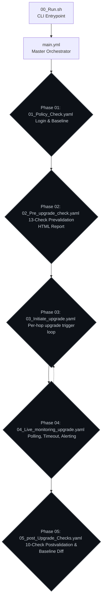

# 🚀 ARO Cluster Upgrade Automation

<div align="center">
  <p>A <strong>rule-based, deterministic Ansible automation suite</strong> for Y-stream (minor) upgrades of Azure Red Hat OpenShift (ARO) clusters as ordered, sequential version hops.</p>
</div>

---

## 📖 Overview

Built for cloud and platform engineers who require a repeatable, auditable, and no-AI-in-the-execution-path workflow. This automation runs **unchanged on both Ansible 2.7.17 (test) and 2.14.18 (prod)** using only `oc`, `jq`, `sendmail`, and shell.

## 📊 Current Status
- **All Units (01–19) Complete** — Full ARO Cluster Upgrade Automation Suite Built.
- **Next Up**: Server testing on RHEL 8 jump host (Ansible 2.7.17 and 2.14.18 syntax and live execution) and end-to-end dry-run validation.

## 🏗️ Architecture & Process Flow

Only **six core files** drive the entire automation process. All heavy lifting resides in reusable roles, tasks, and presentation templates.



### Phase Details

| Phase File | Responsibility | Chaining Type | Gate Model |
|---|---|---|---|
| `00_Run.sh` | CLI base — dynamic paths, argument capture, confirmation | Bash script | `set -euo pipefail` |
| `main.yml` | Master orchestrator — loads `vars/`, prints start banner | Orchestrator | Top-level chain |
| `01_Policy_Check.yaml` | Authenticates session, baseline snapshot, valid target edge | `import_playbook` | **HARD** halt on invalid edge |
| `02_Pre_upgrade_check.yaml`| 13-check prevalidation suite (7 HARD, 6 WARN) & HTML Report | `import_playbook` | **HARD** halt on critical |
| `03_Initiate_upgrade.yaml`| Loops over `upgrade_path` via `tasks/hop.yml` | `include_tasks` + `loop` | **HARD** halt per hop |
| `04_Live_monitoring_upgrade.yaml` | Bounded 2m poll, 90m timeout, heartbeat emails, settle-gate | `include_tasks` | **HARD** halt on stall/timeout|
| `05_post_Upgrade_Checks.yaml` | 10-check postvalidation (5 HARD, 5 WARN) + baseline diff | `import_playbook` | **HARD** halt on post-check |

---

## 🛠️ Prerequisites & Environment Setup

The automation runs on a **RHEL 8 jump server** with direct network reachability to the target ARO cluster API endpoints and SMTP gateway.

### System Requirements
- **OS**: RHEL 8 / CentOS Stream 8 / Rocky Linux 8
- **Ansible**: 2.7.17 (test) or 2.14.18 (prod)
- **OpenShift CLI (`oc`)**: Must match target cluster minor version (e.g., `oc v4.14+`)
- **`jq`**: JSON processor v1.5+ (`sudo dnf install -y jq`)
- **SMTP**: `sendmail` / Postfix configured for email dispatch

---

## ⚙️ Configuration (`playbooks/vars/`)

All configurations are strictly declarative. **Zero logic or hardcoded machine paths live in these files.**

| File | Purpose |
|---|---|
| `upgrade.yml` | Target cluster, version hops, capacity thresholds, timeout/poll cadences |
| `secrets.yml` | Cluster API URLs and credentials (`{{ vault_* }}`) |
| `smtp.yml` | SMTP host, port, sender, recipients, subject prefixes |
| `report_vars.yml` | Brand colors, status tokens, glyphs, and report headers |
| `paths.yml` | Dynamic paths anchored to `playbook_dir` |
| `api_regex.yml` | Regex for API URL validation and cluster name extraction |

### Defining the Upgrade Path (`vars/upgrade.yml`)
```yaml
cluster_name: "cluster-d01"
upgrade_path:
  - "4.14.40"
  - "4.15.35"
```

---

## 🚀 How to Run

Invoke the automation using the CLI entrypoint:

```bash
cd playbooks/

# 1. Hands-Free Execution (reads cluster and path from vars/upgrade.yml)
./00_Run.sh

# 2. Dry-Run Mode (validates policy & prevalidation without triggering upgrade)
./00_Run.sh --dry-run --yes

# 3. CLI Overrides for Cluster and Version Path
./00_Run.sh --cluster cluster-d01 --path "4.14.40,4.15.35"

# 4. Interactive Mode (prompts operator if omitted)
./00_Run.sh
```

### CLI Arguments
- `--cluster <name>`: Override target cluster name.
- `--path <v1,v2>`: Comma-separated list of target version hops.
- `--dry-run`: Executes Phase 01 & Phase 02 ONLY (No upgrades).
- `--yes`: Skips interactive confirmation summary prompt.

---

## 📂 Output Locations & Artifacts

```
playbooks/
├── logs/        
│   ├── <cluster>_<timestamp>.txt       # Human-readable stdout & task run log
│   └── <cluster>_<timestamp>.csv       # Machine-parsable audit trail
├── output/      
│   ├── <cluster>_prevalidation_<timestamp>.html   # Phase 02 Validation Report
│   └── <cluster>_postvalidation_<timestamp>.html  # Phase 05 Verification Report
└── snapshots/   
    └── <cluster>_<timestamp>_baseline.json        # Phase 01 baseline snapshot
```

---

## 🔍 Pre & Post Validation Gates

### Phase 02: Prevalidation (13 Checks)
> [!IMPORTANT] 
> **7 HARD Gates (Halts execution):**
> ClusterOperators Health, Node Health & Readiness, MachineConfigPool Health, etcd Member Health, Admin Acknowledgements, Target Upgrade Edge Validation, Resource Utilization (< 90%).

> [!WARNING]
> **6 WARN Gates (Surfaces in HTML report only):**
> Pending CSRs, Node Disk Pressure, PDB Risk, Node Drain Headroom, Critical Namespace Pod Health, Firing Critical Alerts.

### Phase 05: Postvalidation (10 Checks)
> [!IMPORTANT]
> **5 HARD Gates (Halts execution):**
> ClusterVersion Reached, ClusterOperators Health, MachineConfigPool Health, Node Health & Readiness, etcd Member Health.

> [!WARNING]
> **5 WARN Gates (Surfaces in HTML report only):**
> Firing Critical Alerts, Critical Namespace Pod Health, Baseline Snapshot Diff (No nodes/operators lost), Pending CSRs, Route Reachability Smoke Test.

---

## ⚠️ Common Problems & Troubleshooting

- **Service Account Access / Forbidden Errors**: Phase 03 fails if the service account lacks OpenShift RBAC privileges to patch `clusterversions` or read `machineconfigpools`. The alert email highlights the specific missing resource with actionable remediation.
- **Target Version Not Available**: Phase 01 fails if the target hop is not a valid edge in `status.availableUpdates`.
- **Prevalidation Failure (Exit 10)**: One of the 7 HARD gates failed. Check `output/*_prevalidation_*.html` for a detailed analysis of what failed.
- **MCP Timeout (Exit 30)**: MachineConfigPool update stalled for > 90 minutes. Email alerts are dispatched.
- **Node Cordon/Drain Blocked**: WARN in prevalidation if Pod Disruption Budgets (PDBs) block drain (`fail_on_zero_disruption_pdb` can make this HARD).

---

## 🔒 Key Invariants

1. **No AI in the Execution Path**: All decisions are hardcoded deterministic rules.
2. **Login Once, Logout Always**: Authentication established in Phase 01, teardown guaranteed via `always` block.
3. **Single Cross-Phase Persistence Contract**: The Phase 01 baseline snapshot is the only persisted state.
4. **Minor Versions Are Never Skipped**: Multi-version upgrades execute sequentially.
5. **Secrets Never Written to Disk**: Credentials only live in memory/vaults.

---
