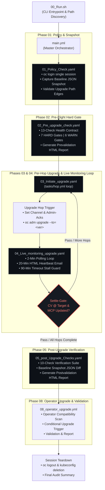

# 🚀 ARO Cluster Upgrade Automation

<div align="center">

[-blue.svg?logo=ansible)](https://docs.ansible.com/ansible/2.7/)
[-red.svg?logo=ansible)](https://docs.ansible.com/ansible/2.14/)
[](https://docs.openshift.com/)
[](https://azure.microsoft.com/services/openshift/)
[-success.svg)](#-key-invariants)
[](https://www.redhat.com/en/technologies/linux-platforms/enterprise-linux)

<p>A <strong>production-grade, rule-based, deterministic Ansible automation suite</strong> for performing multi-version Y-stream (minor) upgrades on <strong>Azure Red Hat OpenShift (ARO)</strong> clusters as ordered, sequential version hops — with <strong>zero AI in the execution path</strong>.</p>

[Quick Start](#-quick-start--cli-operations-guide) • [Architecture](#-architecture--process-flow) • [Validation Gates](#-validation-gate-matrix) • [Configuration](#-declarative-configuration-playbooksvars) • [Documentation](Documentation.md)

</div>

---

## 📖 Overview

Upgrading Azure Red Hat OpenShift (ARO) clusters across minor versions (e.g., `4.18.09 → 4.19.15 → 4.20.08`) requires strict operational discipline: minor versions cannot be skipped, control plane components and MachineConfigPools must settle between hops, and pre-flight capacity checks are critical to prevent cluster-wide outages.

This automation suite provides platform and cloud engineers with an **auditable, fully automated, deterministic workflow**. It runs **identically on Ansible 2.7.17 (test) and Ansible 2.14.18 (production)** without requiring collection installs, Python dependencies, or code modifications.

### 🌟 Key Highlights

- 🎯 **Sequential Multi-Hop Upgrades**: Enforces minor version jumps in strict sequential order; validates every version as an active edge via `oc adm upgrade` before triggering.
- 🛡️ **Hard-Gated Safety Checks**: Enforces a **13-check prevalidation suite** (7 HARD, 6 WARN) before upgrading and a **10-check postvalidation suite** (5 HARD, 5 WARN) after completion.
- ⏱️ **Live Monitoring & Settle Gates**: Polls ClusterVersion, MachineConfigPools, and Nodes every 2 minutes with bounded timeout protection (90 min/hop) and inter-hop stability assertions.
- 📧 **Automated Heartbeats & Change Alerts**: Transmits mobile-optimized, single-card HTML progress reports every 20 minutes and instant alert emails upon state changes or errors.
- 📊 **Audit-Ready Reporting & Dual Logs**: Generates client-facing, printable HTML reports in `output/` and timestamped `.txt` + `.csv` audit trails in `logs/`.
- 🔐 **Zero-Trust Session Lifecycle**: Single `oc login` at start; guaranteed `oc logout` and kubeconfig teardown on failure via `block/rescue/always`.
- 🔑 **Conjur Vault Ready**: Credentials are referenced exclusively via `{{ vault_* }}` variables, enabling a zero-code migration from vars files to Conjur Vault.
- 💻 **Interactive CLI Entrypoint**: Feature-packed Bash wrapper (`00_Run.sh`) with auto-path discovery, interactive menu, dry-run mode, and execution time tracking.

---

## 🏗️ Architecture & Process Flow

The system is governed by a **six-file process surface** (`00_Run.sh` + `01` to `05` playbooks). All execution logic is encapsulated within reusable single-concern roles and presentation templates.



### 📋 The Six Core Process Files

| File | Purpose | Chaining Mechanism | Failure Behavior |
|---|---|---|---|
| `00_Run.sh` | CLI entrypoint, dynamic path discovery, parameter validation, interactive menu | Bash Wrapper (`set -euo pipefail`) | Returns named exit codes (0/1/2/10/20/30/99) |
| `main.yml` | Master orchestrator; chains phases in fixed sequential order | Hybrid (`import_playbook` + loop play) | Halts on first failed phase |
| `01_Policy_Check.yaml` | Authenticates session, captures Phase 01 baseline snapshot, verifies edge eligibility | `import_playbook` | **HARD** halt on invalid edge or login failure |
| `02_Pre_upgrade_check.yaml` | Executes 13-check prevalidation suite; renders client-facing HTML report | `import_playbook` | **HARD** halt on any critical gate failure |
| `03_Initiate_upgrade.yaml` | Iterates sequentially over `upgrade_path` via `tasks/hop.yml` | `include_tasks` + `loop:` | **HARD** halt on trigger failure; alert dispatched |
| `04_Live_monitoring_upgrade.yaml` | Bounded polling loop (2 min), 20-min heartbeat emails, 90-min timeout guard, settle gate | `include_tasks` (per hop) | **HARD** halt on MCP stall/timeout; alert dispatched |
| `05_post_Upgrade_Checks.yaml` | Executes 10-check postvalidation suite and diffs state against baseline snapshot | `import_playbook` | **HARD** halt on target mismatch or health check |
| `08_operator_upgrade.yml` | Operator compatibility scan, conditional upgrade trigger, and final validation | `import_playbook` | **HARD** alert on timeout or incompatibility (does not rollback) |

---

## 🛠️ Prerequisites & Environment Setup

The automation runs from a **RHEL 8 jump host** with direct network connectivity to the target ARO cluster API endpoints and local SMTP gateway.

### System Requirements

| Component | Required Version | Purpose / Installation |
|---|---|---|
| **Operating System** | RHEL 8 / CentOS 8 / Rocky 8 | Execution environment host |
| **Ansible** | `2.7.17` (test) or `2.14.18` (prod) | Orchestration engine (`ansible --version`) |
| **OpenShift CLI (`oc`)** | `4.14+` | Cluster interaction client (`oc version`) |
| **`jq`** | `1.5+` | JSON parsing engine (`sudo dnf install -y jq`) |
| **SMTP Service** | Local MTA / Relay Gateway | Progress heartbeats and failure alerts |

### Required Cluster Permissions

The service account specified in `vars/secrets.yml` (e.g., `svc-aro-upgrade`) requires permissions to read cluster state and initiate upgrades:
- `cluster-admin` (Recommended for full automation) **OR**
- Dedicated `ClusterRoleBinding` granting read/write on `clusterversions.config.openshift.io`, `machineconfigpools.machineconfiguration.openshift.io`, `clusteroperators.config.openshift.io`, `nodes`, `pods`, `persistentvolumes`, and `persistentvolumeclaims`.

---

## ⚙️ Declarative Configuration (`playbooks/vars/`)

All configuration is strictly declarative. **No logic, machine paths, or credentials live inside tasks.**

```
playbooks/vars/
├── upgrade.yml        # Target cluster, version sequences, thresholds, polling cadences
├── secrets.yml        # Cluster API endpoints and credentials ({{ vault_* }} references)
├── smtp.yml           # SMTP server host/port, sender, recipient lists, subject prefixes
├── report_vars.yml    # UI tokens, brand colors, status glyphs, report headers
├── paths.yml          # Dynamic paths anchored to playbook_dir
└── api_regex.yml      # Cluster API regex validation rules
```

### 1. Upgrade Path Configuration (`vars/upgrade.yml`)
```yaml
---
# Default target cluster and version hop sequence
cluster_name: "cluster-d01"
upgrade_path:
  - "4.14.40"
  - "4.15.35"
  - "4.16.18"

# Safety thresholds & cadences
max_cpu_percent: 90
max_memory_percent: 90
poll_interval_minutes: 2
hop_timeout_minutes: 90
heartbeat_minutes: 20
fail_on_zero_disruption_pdb: false
allowed_unschedulable_nodes: []
```

### 2. Cluster Secrets Configuration (`vars/secrets.yml`)
```yaml
---
clusters:
  - name: "cluster-d01"
    api_url: "https://api.cluster-d01.example.com:6443"
    username: "svc-aro-upgrade"
    password: "{{ vault_cluster_d01_password }}"
```

> [!NOTE]
> Passwords use `{{ vault_* }}` variable references. To migrate to Conjur Vault, replace this vars file with a dynamic Conjur lookup plugin — no playbook task modifications required.

---

## 🚀 Quick Start & CLI Operations Guide

Navigate to the `playbooks/` directory on your jump host to run the suite:

```bash
cd playbooks/
```

### Common Execution Modes

```bash
# 1. Fully Hands-Free Execution (reads cluster and path from vars/upgrade.yml)
./00_Run.sh

# 2. Interactive Upgrade Path Selection (displays color-coded menu of configured paths)
./00_Run.sh

# 3. Dry-Run Validation Mode (executes Phase 01 & Phase 02 checks without upgrading)
./00_Run.sh --dry-run --yes

# 4. CLI Overrides for Specific Cluster and Version Hops
./00_Run.sh --cluster cluster-d01 --path "4.15.35,4.16.18" --yes

# 5. Non-Interactive Execution with Configured Default (bypasses selection menu)
./00_Run.sh --no-menu --yes
```

### ⌨️ CLI Options Reference

| Flag | Description |
|---|---|
| `--cluster <name>` | Target cluster name (must exist in `vars/secrets.yml`). |
| `--path <v1,v2>` | Comma-separated list of target version hops (bypasses menu). |
| `--dry-run` | Runs Phase 01 & Phase 02 only; safely logs out without triggering upgrades. |
| `--yes`, `-y` | Skips the interactive confirmation prompt before execution. |
| `--no-menu` | Bypasses the interactive upgrade path menu and uses `upgrade_path` from `vars/upgrade.yml`. |
| `--help`, `-h` | Displays usage summary, flag descriptions, and exit code reference. |

### 🚦 Exit Code Taxonomy

| Exit Code | Meaning | Operator Action |
|---|---|---|
| `0` | **Success** | Upgrade completed successfully; review `output/*_postvalidation_*.html`. |
| `1` | **Usage / Argument Error** | Invalid flags or missing parameters; verify CLI syntax. |
| `2` | **Cancelled by User** | Execution aborted at confirmation prompt. |
| `10` | **Prevalidation Failure** | Phase 02 HARD check failed; inspect `output/*_prevalidation_*.html`. |
| `20` | **Upgrade Execution Failure** | Phase 03 trigger failed; check alert email and `logs/*.txt`. |
| `30` | **Monitoring / Settle Timeout** | MCP stalled > 90 minutes; check alert email for degraded nodes/pools. |
| `99` | **Unknown / Unhandled Error** | Fatal unexpected error; review `logs/*.txt` and `logs/*.csv`. |

---

## 🔍 Validation Gate Matrix

### Phase 02: Pre-Upgrade Validation (13 Checks)

Before triggering any upgrade hop, Phase 02 evaluates the cluster against a 13-check contract:

| # | Check Name | Gate Type | Verification Rationale |
|---|---|---|---|
| `01` | **ClusterOperators Health** | **HARD** | Asserts all operators report `Available=True` and `Degraded=False`. |
| `02` | **Node Health & Readiness** | **HARD** | Asserts all nodes are `Ready=True`; cordons must be explicitly allow-listed. |
| `03` | **MachineConfigPool Health** | **HARD** | Asserts pools are `Updated=True`, `Degraded=False`, and `paused=false`. |
| `04` | **etcd Member Health** | **HARD** | Asserts all `openshift-etcd` pods are `Running`/`Ready` with zero operator degraded conditions. |
| `05` | **Admin Acknowledgements** | **HARD** | Checks `Upgradeable` condition and `openshift-config/admin-acks` ConfigMap for API removal gates. |
| `06` | **Target Upgrade Edge Validation**| **HARD** | Re-verifies target hop version exists in live `status.availableUpdates`. |
| `07` | **Resource Utilization** | **HARD** | Calculates requests-based CPU & Memory allocatable capacity (< 90% threshold). |
| `08` | **Pending CSRs** | **WARN** | Scans for unapproved Certificate Signing Requests. |
| `09` | **Node Disk Pressure** | **WARN** | Scans for active `DiskPressure=True` node conditions. |
| `10` | **Pod Disruption Budget Risk** | **WARN** | Scans for 0-disruption PDBs that could block worker node drains (can escalate to HARD). |
| `11` | **Node Drain Headroom** | **WARN** | Projects cluster capacity if the largest worker node is evicted during upgrade. |
| `12` | **Critical Namespace Pods** | **WARN** | Scans `openshift-*` and `kube-system` for non-Running or CrashLooping pods. |
| `13` | **Firing Critical Alerts** | **WARN** | Queries Prometheus / Alertmanager for active critical alerts. |

### Phase 05: Post-Upgrade Verification (10 Checks)

After completing all version hops, Phase 05 verifies cluster state and compares against the Phase 01 baseline:

| # | Check Name | Gate Type | Verification Rationale |
|---|---|---|---|
| `01` | **Target Version Reached** | **HARD** | Asserts `clusterversion` matches final target and `Progressing=False`. |
| `02` | **ClusterOperators Health** | **HARD** | Asserts all operators are `Available=True` and `Progressing=False`. |
| `03` | **MachineConfigPool Health** | **HARD** | Asserts all pools report `Updated=True` and `Degraded=False`. |
| `04` | **Node Health & Kubelet Verification** | **HARD** | Asserts all nodes are `Ready` and kubelet versions match target OpenShift version. |
| `05` | **etcd Member Health** | **HARD** | Asserts all etcd members are healthy and control plane operators report normal. |
| `06` | **Firing Critical Alerts** | **WARN** | Asserts no new critical Prometheus alerts fired during upgrade. |
| `07` | **Critical Namespace Pods** | **WARN** | Verifies health of core system pods across all infrastructure namespaces. |
| `08` | **Baseline Snapshot Diff** | **WARN** | Diffs live state against Phase 01 baseline JSON to ensure no lost nodes/operators/routes. |
| `09` | **Pending CSRs** | **WARN** | Verifies no post-upgrade certificate requests remain pending. |
| `10` | **Workload & Route Smoke Test** | **WARN** | Verifies default ingress controller and console route accessibility. |

---

## 📊 Generated Artifacts & Output Directory

Each run writes structured artifacts to isolated, write-only directories:

```
playbooks/
├── logs/        
│   ├── <cluster>_<timestamp>.txt       # Full terminal stdout log (tee'd live)
│   └── <cluster>_<timestamp>.csv       # Machine-parsable audit record with status per check
├── output/      
│   ├── <cluster>_prevalidation_<timestamp>.html   # Client-facing Phase 02 HTML Report
│   └── <cluster>_postvalidation_<timestamp>.html  # Client-facing Phase 05 HTML Report
└── snapshots/   
    └── <cluster>_<timestamp>_baseline.json        # Phase 01 JSON baseline snapshot
```

### HTML Reports Feature Highlights

- **At-a-Glance Executive Summary**: Metrics grid detailing total evaluated checks, passed checks, warnings, and hard failures.
- **Colour-Coded Status Table**: Green (`PASS ✔`), Amber (`WARN !`), and Red (`FAIL ✖`) status badges with explicit values.
- **Collapsible Diagnostic Details**: Full `oc`/`jq` inspection payloads embedded inside `<details>` tags for zero-noise scanning.
- **One-Click Diagnostics Copy**: Client-side JavaScript button to copy cluster metadata and diagnostics to clipboard.
- **Print & PDF Optimized**: `@media print` stylesheets ensure clean, grayscale-safe PDF export for client deliverables.

---

## 📧 Live Notifications & Email Engine

During multi-hour upgrades, the automation keeps operators informed with high-impact, single-card HTML emails:

```
┌─────────────────────────────────────────────────────────────┐
│  ARO CLUSTER UPGRADE: cluster-d01                [IN-PROGRESS]│
│  Hop 1 of 2  •  Target: 4.15.35  •  Progress: 66% (4/6 Ready)│
├─────────────────────────────────────────────────────────────┤
│  MachineConfigPool Status:                                  │
│  • master: 3/3 Ready (Updated=True, Degraded=False)   [PASS]│
│  • worker: 1/3 Ready (Updating=True, Degraded=False)  [WARN]│
│                                                             │
│  Active Working Node:                                       │
│  • aro-worker-eastus-1 (SchedulingDisabled / Draining)      │
│                                                             │
│  Next update in 20 minutes (or immediately on state change) │
└─────────────────────────────────────────────────────────────┘
```

- **MCP State Display**: Always shows real-time pool status (`ready/total`, `Updated`, `Updating`, `Degraded`).
- **Active Node Activity**: Surfaces active draining/rebooting nodes and degraded-only nodes (omits healthy nodes to keep emails concise).
- **Automated RBAC Error Detection**: If an operation fails due to missing permissions (`forbidden`, `cannot patch`), the failure email renders a dedicated warning box with the exact missing OpenShift API resource and remediation command.

---

## 🔒 Key Invariants

1. **Deterministic Execution (Zero AI)**: Every routing choice, gate decision, and failure trigger is a hardcoded rule (`when:`/`fail:`). No probabilistic models or agentic branches exist in the execution path.
2. **Single Session Lifecycle**: Authenticates once at Phase 01; reuses the session; guarantees complete session cleanup (`oc logout` + kubeconfig deletion) via `block/rescue/always`.
3. **Single Cross-Phase Persistence Contract**: The Phase 01 baseline JSON snapshot is the **only** persisted state between phases; all other decisions read fresh, live data from `oc`.
4. **Sequential Minor Version Hops**: Multi-version jumps execute one minor version at a time (`4.18 → 4.19 → 4.20`), verifying target edges dynamically before each trigger.
5. **Zero Credentials on Disk**: Secrets exist strictly as variable references in memory and are protected with `no_log: true`.

---

## 📚 Technical Documentation

For complete architectural specifications, internal role catalogs, Jinja2 design tokens, troubleshooting runbooks, and cumulative changelogs, refer to:

👉 **[Complete Technical Documentation (Documentation.md)](Documentation.md)**

---

<div align="center">
  <sub>ARO Cluster Upgrade Automation • Maintained for Enterprise OpenShift Operations</sub>
</div>
