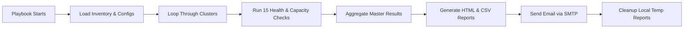

# ARO Cluster Capacity & Health Check Automation

[](https://www.ansible.com/)
[](https://cloud.redhat.com/)
[](https://docs.openshift.com/)
[](#)

An automated Ansible solution designed to perform comprehensive health, resource utilization, and capacity assessments across multiple **Azure Red Hat OpenShift (ARO)** and **OpenShift Container Platform (OCP)** clusters.

It evaluates 15 critical infrastructure checks, generates interactive **HTML** and **CSV** reports, and sends an executive summary email directly to operations and engineering teams.

---

## 📌 Table of Contents

- [Features](#-features)
- [How It Works](#-how-it-works)
- [The 15 Health & Capacity Checks](#-the-15-health--capacity-checks)
- [Repository Structure](#-repository-structure)
- [Prerequisites](#-prerequisites)
- [Configuration](#-configuration)
  - [1. Cluster Inventory (`clusters.yml`)](#1-cluster-inventory-clustersyml)
  - [2. Excluded Namespaces (`exclude_namespaces.yml`)](#2-excluded-namespaces-exclude_namespacesyml)
  - [3. Email & SMTP Settings (`email_vars.yml`)](#3-email--smtp-settings-email_varsyml)
  - [4. Thresholds & Window Settings](#4-thresholds--window-settings)
- [Usage](#-usage)
  - [Run Full Assessment & Email](#run-full-assessment--email)
  - [Resend Email Only](#resend-email-only)
- [Reports & Outputs](#-reports--outputs)
- [Troubleshooting & FAQ](#-troubleshooting--faq)

---

## 🚀 Features

- **Multi-Cluster Support**: Scan multiple ARO/OCP clusters in a single playbook execution.
- **15 In-Depth Checks**: Audits control plane health, operator status, node overcommit, actual usage, pod health, storage, and active alerts.
- **Interactive HTML Report**: Includes visual pass/warn/fail status cards, CPU/Memory progress bars, collapsible sections, and 1-click node copy buttons.
- **CSV Export**: Machine-readable breakdown of every check per cluster for audits and external reporting.
- **Automated Email Notifications**: Delivers an executive email summary along with the HTML & CSV reports attached.
- **Namespace Whitelisting/Exclusions**: Easily ignore known system or vendor namespaces (e.g., Twistlock, Insights) to eliminate false alerts.

---

## 🔄 How It Works


```mermaid
flowchart LR
    A[Playbook Starts] --> B[Load Inventory & Configs]
    B --> C[Loop Through Clusters]
    C --> D[Run 15 Health & Capacity Checks]
    D --> E[Aggregate Master Results]
    E --> F[Generate HTML & CSV Reports]
    F --> G[Send Email via SMTP]
    G --> H[Cleanup Local Temp Reports]
```

1. **Initialization**: Reads target clusters, excluded namespaces, and alerting thresholds.
2. **Cluster Assessment**: Logs into each cluster using the OpenShift CLI (`oc`) and runs 15 targeted queries.
3. **Report Generation**: Aggregates statuses into an interactive HTML dashboard and a CSV file.
4. **Email Delivery**: Uses an embedded Ansible role (`sendmail`) to email results to stakeholders.
5. **Cleanup**: Removes local temporary report artifacts after successful delivery.

---

## 🔍 The 15 Health & Capacity Checks

| # | Check Name | Description | Status Criteria |
|---|---|---|---|
| **1** | **ClusterVersion Status** | Verifies OCP version and checks `Available`, `Degraded`, and `Progressing` conditions | **PASS**: Available=True & Degraded!=True |
| **2** | **Insights Operator** | Confirms the Insights Operator is healthy and active | **PASS**: Degraded!=True |
| **3** | **Control Plane Health** | Checks API server status and master node conditions | **PASS**: All master nodes Ready |
| **4** | **Cluster Operators** | Scans all cluster operators (`oc get co`) | **PASS**: All available and not degraded |
| **5** | **Cluster Alerts** | Checks active alerts from Prometheus/Alertmanager within the alert window | **PASS**: No alerts \| **WARN**: Warning alerts \| **FAIL**: Critical alerts |
| **6** | **Node Status** | Validates worker and infra node conditions | **PASS**: All nodes in `Ready` state |
| **7** | **Node Resource Pressure** | Checks for `MemoryPressure`, `DiskPressure`, or `PIDPressure` | **PASS**: Zero nodes under pressure |
| **8** | **Node CPU Overcommit** | Calculates requested CPU against allocatable capacity | **PASS** ≤ 85% \| **WARN** > 85% \| **FAIL** > 95% |
| **9** | **Node Memory Overcommit** | Calculates requested Memory against allocatable capacity | **PASS** ≤ 85% \| **WARN** > 85% \| **FAIL** > 95% |
| **10** | **Node CPU Actual Usage** | Evaluates real-time node CPU utilization metrics | **PASS** ≤ 85% \| **WARN** > 85% \| **FAIL** > 95% |
| **11** | **Node Memory Actual Usage** | Evaluates real-time node Memory utilization metrics | **PASS** ≤ 85% \| **WARN** > 85% \| **FAIL** > 95% |
| **12** | **Pod Health** | Identifies problematic pods (CrashLoopBackOff, Error, Failed) | **PASS**: 0 problematic pods \| **WARN**: Issues detected |
| **13** | **MCP Status** | Checks MachineConfigPools (`master`, `worker`) updating/degraded states | **PASS**: Updated=True, Degraded=False |
| **14** | **StorageClasses** | Checks configured StorageClasses and identifies default storage class | **PASS**: StorageClasses present |
| **15** | **PVC Status** | Verifies PersistentVolumeClaims are `Bound` | **PASS**: No PVCs stuck in `Pending`/`Lost` |

### 🚦 Health & Status Rollup Logic

The playbook calculates the **Overall Status** of each cluster based on a hierarchical rollup:

1. **🔴 FAIL**: Assigned if cluster login fails OR if **any** of the 15 checks returns a `FAIL` status.
2. **🟡 WARN**: Assigned if **no** checks failed, but **one or more** checks return a `WARN` status (e.g. CPU/Memory overcommit > 85%, active warning alerts, or non-running pods).
3. **🟢 PASS**: Assigned only when **all 15 checks** evaluate to `PASS`.

> **Note on Summary Cards**: The executive summary cards at the top of the email digest and HTML report count **Clusters by their Overall Status** (`Total Clusters`, `Passed Clusters`, `Warning Clusters`, `Failed Clusters`). Individual check metrics (`11/15 passed`) and sub-table breakdowns are displayed in the cluster section below.

---

## 📁 Repository Structure

```text
aro-capacity-check/
├── capacity_check.yml       # Main playbook: initialization, loop, report & email trigger
├── cluster_checks.yml      # Tasks file: contains all 15 check implementations
├── clusters.yml            # Inventory file: target cluster URLs and credentials
├── exclude_namespaces.yml  # Namespaces excluded from pod failure checks
├── email_vars.yml          # SMTP server details and email distribution list
├── SendEmail.yml           # Standalone playbook to trigger report email delivery
├── sendmail/               # Ansible role for formatting & sending HTML emails
│   └── tasks/
│       └── main.yml        # Role logic: email body templating and SMTP dispatch
└── README.md               # Project documentation
```

---

## ⚙️ Prerequisites

Ensure the following tools are installed on the machine running Ansible:

1. **Ansible**: Version 2.7.17 or newer.
   ```bash
   ansible --version
   ```
2. **OpenShift CLI (`oc`)**: Must be installed at `/usr/local/bin/oc` or available in `$PATH`.
   ```bash
   oc version --client
   ```
3. **`jq` utility**: Used for JSON parsing in shell tasks.
   ```bash
   jq --version
   ```
4. **Network Access**:
   - Outbound access to target cluster API URLs (`port 6443`).
   - Outbound access to your internal SMTP server (`port 25` or configured port).

---

## 🛠️ Configuration

### 1. Cluster Inventory (`clusters.yml`)

Define the clusters to evaluate with API endpoints and service account credentials:

```yaml
---
clusters:
  - name: "arod01"
    api_url: "https://api.arod01.dev.example.com:6443"
    username: "service-account"
    password: "secure-password-or-token"

  - name: "arod03"
    api_url: "https://api.arod03.dev.example.com:6443"
    username: "service-account"
    password: "secure-password-or-token"
```

> 🔒 **Security Tip**: For production environments, use [Ansible Vault](https://docs.ansible.com/ansible/latest/vault_guide/index.html) to encrypt sensitive credentials in `clusters.yml`.

### 2. Excluded Namespaces (`exclude_namespaces.yml`)

Add namespaces that should be bypassed during Pod failure and CrashLoopBackOff checks:

```yaml
---
exclude_namespaces:
  - openshift-insights
  - twistlock
  - openshift-gitops
  - default
```

### 3. Email & SMTP Settings (`email_vars.yml`)

Configure the SMTP relay host and recipients who will receive reports:

```yaml
---
smtp_host: smtp.example.com
smtp_port: 25
sender: Cluster-Upgrade-Automation@ARO-Team
recipients:
  - user1@example.com
  - user2@example.com
```

### 4. Thresholds & Window Settings

Global thresholds can be modified at the top of `capacity_check.yml`:

```yaml
report_dir: "./reports"       # Temporary directory where reports are created
warn_threshold: 85            # Triggers WARN if resource usage exceeds 85%
fail_threshold: 95            # Triggers FAIL if resource usage exceeds 95%
alert_window: "6h"            # Prometheus alert lookback window (e.g., 6h)
```

---

## 💻 Usage

### Run Full Assessment & Email

Execute the main playbook from the repository root:

```bash
ansible-playbook capacity_check.yml
```

**What this does:**
1. Validates connectivity and logs into each cluster.
2. Runs all 15 checks sequentially per cluster.
3. Builds the HTML and CSV reports under `./reports/`.
4. Dispatches the email with summary details and attached reports.
5. Deletes `./reports/` upon completion.

### Resend Email Only

If you generated reports manually and only wish to trigger the email notification:

```bash
ansible-playbook SendEmail.yml
```

---

## 📊 Reports & Outputs

### 1. Interactive HTML Report (`.html`)
- **Header & Metric Counters**: High-level cluster count, total PASS/WARN/FAIL tally, and execution timestamp.
- **Resource Bars**: Visual percentage bars for CPU/Memory requests and actual usage.
- **Problematic Pods Table**: Highlights pods failing outside the excluded namespaces.
- **Copy Node Helper**: Click-to-copy button next to nodes with warnings or failures for fast troubleshooting.

### 2. CSV Report (`.csv`)
Formatted for spreadsheet analysis and SIEM/ticketing ingestion:
```csv
Cluster Name,API URL,OCP Version,Overall Status,Check Name,Check Status,Details
"arod01","https://api.arod01...","4.12.24","PASS","ClusterVersion Status","PASS","Version: 4.12.24 | Available: True | Degraded: False | Progressing: False"
```

---

## ❓ Troubleshooting & FAQ

<details>
<summary><b>1. Cluster login fails with TLS verification errors</b></summary>
The playbook uses <code>--insecure-skip-tls-verify=true</code> by default in <code>cluster_checks.yml</code>. If connection fails, ensure the API URL is reachable from the Ansible runner host:
<pre>curl -k https://&lt;api-url&gt;:6443/readyz</pre>
</details>

<details>
<summary><b>2. How can I keep the generated reports locally instead of deleting them?</b></summary>
In <code>capacity_check.yml</code>, comment out or remove the final cleanup task at the bottom:
<pre>
# - name: "Delete the Logs"
#   file:
#     path: "{{ report_dir }}"
#     state: absent
</pre>
</details>

<details>
<summary><b>3. Why are some pod crashes not showing up in the report?</b></summary>
Verify whether the pod resides in a namespace listed in <code>exclude_namespaces.yml</code>. Namespaces listed there are excluded by design to prevent noise from transient pods.
</details>

---

## 👥 Authors & Maintainers

- **ARO Infrastructure & Cloud Operations Team**
- Automation maintained for OpenShift / Azure Red Hat OpenShift operations.
